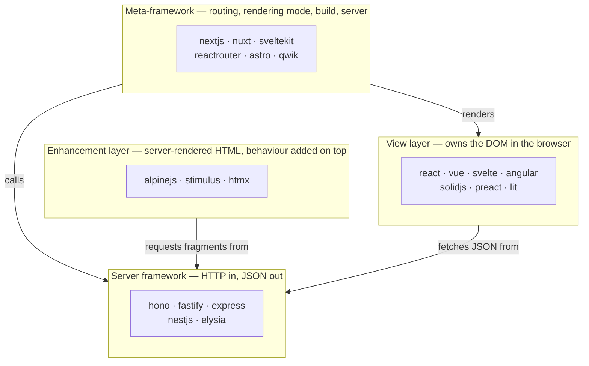

# JavaScript

JavaScript is a dynamic, prototype-based, garbage-collected programming language standardized as ECMAScript. It is the native scripting language of web browsers and also runs outside the browser in environments such as Node.js, making it common for client-side interfaces, servers, tooling, and automation.

According to [Wikipedia](https://en.wikipedia.org/wiki/JavaScript), JavaScript was created by Brendan Eich in 1995, shipping first under the name LiveScript before Netscape renamed it JavaScript for its official release that December. It is maintained as the ECMAScript standard by Ecma International's TC39 committee and supports event-driven, functional, and imperative programming styles alongside APIs for text, dates, regular expressions, and the Document Object Model.

JavaScript experiments covering browser-side snippets, frameworks, and Node.js.

## Layout

Files directly under this directory are standalone scripts loaded straight into a
page or a browser extension.

Subdirectories group experiments by library or theme:

- Cross-language exercise sets: [`basics`](basics/) and [`math`](math/), whose
  exercises and expected output are described in the repository
  [README](../README.md#the-basics-directory)
- Visualization: [`d3js`](d3js/)
- Server-side and realtime: [`nodejs`](nodejs/), [`socketio`](socketio/)
- Browser snippets and pages: [`bookmarklet`](bookmarklet/), [`ksk`](ksk/)
- Data formats: [`json`](json/)
- Client-side frameworks, older generation: [`backbonejs`](backbonejs/),
  [`knockoutjs`](knockoutjs/)
- Frameworks in current use: see the table below

Every subdirectory carries its own README saying what is in it, what the
samples show, and what no longer runs as written.

Several of the framework directories below are written in TypeScript, because
that is what the framework expects — `angular`, `nestjs`, `nextjs`, `nuxt`,
`qwik`, `reactrouter`, `elysia`, and parts of `astro`. They stay here with the
framework they belong to. The top-level [`typescript`](../typescript/)
directory holds the language exercise sets only.

## Frameworks

One directory per framework, each with a README naming the version it was
written against and how to run the samples. Most of them build the same two
toys — a counter and a todo list — so the directories can be read side by side
to see what each framework does differently.

| Directory | What it is |
| --- | --- |
| [`react`](react/) | The baseline: hooks, `useReducer`, a custom data-fetching hook |
| [`vue`](vue/) | Composition API, single file components, composables |
| [`svelte`](svelte/) | Svelte 5 runes (`$state`, `$derived`, `$effect`) |
| [`angular`](angular/) | Standalone components, signals, `inject()` |
| [`solidjs`](solidjs/) | Signals with no virtual DOM; components run once |
| [`preact`](preact/) | React's API in ~3 kB, plus signals; no build step needed |
| [`lit`](lit/) | Custom elements, shadow DOM, reactive controllers |
| [`qwik`](qwik/) | Resumability: no JavaScript runs until it is needed |
| [`alpinejs`](alpinejs/) | Behaviour declared in HTML attributes, jQuery's old niche |
| [`htmx`](htmx/) | The server returns HTML fragments; the client keeps no state |
| [`stimulus`](stimulus/) | Hotwire: controllers attached to server-rendered markup |
| [`nextjs`](nextjs/) | React App Router: server components, actions, route handlers |
| [`nuxt`](nuxt/) | Vue meta-framework: file routes, auto-imports, Nitro endpoints |
| [`sveltekit`](sveltekit/) | Svelte meta-framework: `+page`/`+server` conventions, form actions |
| [`reactrouter`](reactrouter/) | React Router framework mode, formerly Remix: loaders and actions |
| [`astro`](astro/) | Static HTML by default, interactive islands where asked |
| [`hono`](hono/) | Web-standard router that runs on any JavaScript runtime |
| [`fastify`](fastify/) | Node server with JSON Schema on every route |
| [`express`](express/) | Express 5, including what changed from Express 4 |
| [`nestjs`](nestjs/) | Decorators, modules, and dependency injection on the server |
| [`elysia`](elysia/) | Bun-first server where schemas double as types |

The rest of this file is the part that no single directory can carry: what the
twenty-one of them are alternatives *for*, and how they compare. Each
directory's own README covers what its sample demonstrates, how the pieces in
it connect, and where that framework came from.

## Four layers, not one list

The directories are not twenty-one competitors for one job. They occupy four
positions in a stack, and a real application usually picks one from more than
one row.

- **View layer.** A library that turns state into DOM. On its own it has no
  router, no server, and no build configuration; `npm create vite` supplies
  those. Everything in `react`, `vue`, `svelte`, `angular`, `solidjs`,
  `preact`, and `lit` is this layer, and their samples are deliberately the
  same counter and todo list so the differences are visible.
- **Enhancement layer.** The page arrives as HTML from a server, and the
  library adds behaviour to markup it did not create. `alpinejs` and
  `stimulus` keep small amounts of state in the browser; `htmx` keeps none and
  asks the server for the next fragment of HTML.
- **Meta-framework.** A view library plus routing, a rendering mode
  (CSR/SSR/SSG/islands), a build pipeline, and a server runtime, wired together
  with conventions. `nextjs` and `reactrouter` wrap React, `nuxt` wraps Vue,
  `sveltekit` wraps Svelte, and `astro` renders any of them into static HTML
  with opt-in islands. `qwik` straddles the line: `counter.tsx` and `todo.tsx`
  are view-layer components, while `routes/index.tsx` is Qwik City, the routing
  and server half.
- **Server framework.** No rendering at all: routing, middleware, validation,
  and a JSON body. `express`, `fastify`, `hono`, `nestjs`, and `elysia` differ
  in how much structure they impose and which runtimes they target.

## The axes the choice actually turns on

**Library or full framework.** React and Vue decide how a component renders and
leave routing, data fetching, and forms to you; Angular, Nest, and the
meta-frameworks decide those too. The first buys freedom and costs a
per-project assembly decision that every new team member must learn; the second
buys a shared vocabulary and costs the ability to deviate from it.

**Where the HTML is produced.** `react/counter.html` produces it in the browser
from an empty `
` (CSR). `nextjs`, `nuxt`, `sveltekit`, and `reactrouter`
produce it on a server per request and hydrate it (SSR). `astro` produces it at
build time and ships no JavaScript unless a component asks for it (SSG plus
islands). `htmx` produces it on the server for every interaction, not just the
first. `qwik` produces it on the server and then *resumes* rather than
hydrating. This choice determines first-load cost, SEO behaviour, and how much
of the application can run without a server at all.

**Which side holds the state.** In the view-layer directories the state is a
JavaScript value in the browser and the server is a JSON endpoint. In `htmx`
the state is on the server and the browser holds a document. `stimulus` and
`alpinejs` sit between: server-owned data, browser-owned interaction state.
Nothing else about a stack changes as much as this does — it decides whether
you need an API layer, a client cache, and a serialisation format at all.

**Which runtime.** `express` and `fastify` assume Node's `req`/`res`. `hono`
assumes the web-standard `Request`/`Response` and therefore also runs on
Workers, Deno, and Bun. `elysia` targets Bun first. The meta-frameworks all
build for Node and most also build for an edge runtime, which restricts what
their server code may use (no filesystem, no long-lived connections, limited
CPU time).

**Convention or configuration.** `sveltekit` and `nuxt` derive routes from file
names; `reactrouter` writes them in `app/routes.ts`; `nestjs` derives nothing
and declares everything in modules. Conventions remove decisions and make
unfamiliar codebases legible, at the cost of behaviour that cannot be traced by
reading the code alone.

**Team and lifetime.** Every framework here can build a small application.
They differ in what happens at fifty screens and five developers: whether
module boundaries are enforced (`nestjs`, `angular`), whether types cross the
client/server boundary (`reactrouter`, `elysia`, `nuxt`), and whether upgrades
are predictable (`angular` and `reactrouter` publish a fixed cadence; `astro`
and `next` ship majors roughly yearly with codemods).

## Comparison: basic characteristics

| Directory | Role | Rendering | Runtime | Build step | What the sample shows |
| --- | --- | --- | --- | --- | --- |
| `react` | View library | CSR (SSR via a meta-framework) | Browser | Only for JSX | Hooks, `useReducer`, a fetch hook with `AbortController` |
| `vue` | View library | CSR (SSR via Nuxt) | Browser | Only for SFCs | Composition API, an SFC, two composables |
| `svelte` | Compiled view library | CSR (SSR via SvelteKit) | Browser | Always | Runes, deep reactivity, shared state in a `.svelte.js` module |
| `angular` | Full client framework | CSR (SSR via Angular SSR) | Browser | Always | Standalone components, signals, an injected service |
| `solidjs` | View library | CSR (SSR via SolidStart) | Browser | Always | Signals, a store with path updates, `createResource` |
| `preact` | View library | CSR | Browser | Optional (`htm`) | React's hook API without a compiler, plus signals |
| `lit` | Custom element library | CSR | Browser | None | Reactive properties, shadow DOM styles, a reactive controller |
| `qwik` | Resumable framework | SSR + resumability | Node/edge server | Always | `$` boundaries, `useStore`, `routeLoader$`/`routeAction$` |
| `alpinejs` | DOM enhancement | Server-rendered HTML | Browser | None | `x-data` components, `Alpine.data`, a global store |
| `htmx` | HTML-over-the-wire | Server-rendered fragments | Any server | None | Four attribute patterns against a dependency-free Node server |
| `stimulus` | DOM enhancement | Server-rendered HTML | Browser | None | Targets, actions, values; controllers over existing markup |
| `nextjs` | React meta-framework | SSR/SSG/streaming | Node, edge | Always | Server components, a route handler, server actions |
| `nuxt` | Vue meta-framework | SSR/SSG, per-route | Node, edge (Nitro) | Always | `useFetch` payload reuse, a Nitro endpoint, `routeRules` |
| `sveltekit` | Svelte meta-framework | SSR/SSG/SPA, per-route | Node, edge | Always | `load` split across universal and server files, form actions |
| `reactrouter` | React meta-framework | SSR (SPA/SSG modes) | Node, edge | Always | Route config, `loader`/`action`, a resource route |
| `astro` | Content meta-framework | SSG first, SSR optional | Node, edge | Always | Zero-JS pages, three island directives, `getStaticPaths` |
| `hono` | Server framework | — | Node, Bun, Deno, Workers | None | Routing, the onion middleware model, CRUD with hand validation |
| `fastify` | Server framework | — | Node | None | JSON Schema validation and serialisation, plugin encapsulation |
| `express` | Server framework | — | Node | None | The middleware chain, a `Router`, Express 5 async errors |
| `nestjs` | Server framework | — | Node | Always (TypeScript) | Modules, DI, DTO validation through a global pipe |
| `elysia` | Server framework | — | Bun (Node via adapter) | None on Bun | Schemas that are both runtime checks and static types |

"Build step: none" means the file in this repository opens in a browser or runs
under `node` as it stands. It does not mean production deployments skip
bundling.

## Comparison: architecture

| Directory | Routing | State lives in | Server code in the sample | Client/server boundary |
| --- | --- | --- | --- | --- |
| `react` | None (add React Router) | Component hooks | None | Whatever `fetch` you write |
| `vue` | None (add Vue Router) | `ref` / `computed` | None | Whatever `fetch` you write |
| `svelte` | None (add SvelteKit) | Runes, module singletons | None | Whatever `fetch` you write |
| `angular` | `@angular/router` | Signals in a root service | None | `HttpClient`, provided in `main.ts` |
| `solidjs` | None (add `@solidjs/router`) | Signals and stores | None | `createResource` |
| `preact` | None | Hooks, or signals outside the tree | None | `fetch` in a hook |
| `lit` | None | Element properties, controllers | None | Whatever the element does |
| `qwik` | Qwik City file routes | Serialisable signals and stores | `routeLoader$` / `routeAction$` | `$` boundary; closures must serialise |
| `alpinejs` | The server's URLs | `x-data` objects, `Alpine.store` | None (any server) | Page loads and `fetch` |
| `htmx` | The server's URLs | The server | `server.js`, plain `node:http` | Every interaction is a request |
| `stimulus` | The server's URLs | Controller instances, `values` | None (Rails, typically) | Page loads and form posts |
| `nextjs` | `app/` file routes | Server components and `useState` | Route handlers, server actions | `"use client"` marks the boundary |
| `nuxt` | `app/pages/` file routes | `useState`, composables | `server/api/*`, run by Nitro | Payload serialised into the HTML |
| `sveltekit` | `src/routes/` file routes | Runes, `load` return values | `+page.server.js`, `+server.js` | File name: `.server.` never ships |
| `reactrouter` | `app/routes.ts` | Loader data, component state | `loader` / `action` per route | Module exports; types generated per route |
| `astro` | `src/pages/` file routes | Island-local only | Frontmatter (build time), endpoints | `client:*` directives |
| `hono` | Explicit `app.get(...)` | — | The whole file | — |
| `fastify` | Explicit, per plugin scope | — | The whole file | — |
| `express` | Explicit, per router | — | The whole file | — |
| `nestjs` | Controller decorators | — | The whole tree | — |
| `elysia` | Method chain | — | The whole file | — |

## Comparison: strengths, weaknesses, fit

| Directory | Main strength | Main weakness | Best fit | Scale | Learning cost | Ecosystem |
| --- | --- | --- | --- | --- | --- | --- |
| `react` | Largest hiring pool and library set | Re-render model must be managed by hand; no answers included | Anything, especially where staffing matters | Small to very large | Low to start, high to master | Largest of any entry here |
| `vue` | Readable defaults; SFCs keep a feature in one file | Two APIs in circulation (Options and Composition) | Product UIs, admin screens, teams that value consistency | Small to large | Low | Large, mostly first-party |
| `svelte` | Compiles away; least ceremony per feature | Smaller library set; runes are a recent relearn | Interactive UIs where bundle size matters | Small to medium-large | Low | Modest but coherent |
| `angular` | Batteries included and enforced structure | Heaviest concepts and tooling; slowest to start | Long-lived enterprise applications, large teams | Medium to very large | High | Large, first-party |
| `solidjs` | Fine-grained updates without a virtual DOM | Small ecosystem; React habits mislead | Performance-sensitive UIs, dashboards | Small to medium | Medium | Small |
| `preact` | React's API at a fraction of the size; runs unbuilt | Edge-case React compatibility; smaller community | Widgets, embeds, size-constrained pages | Small to medium | Low if you know React | Rides React's, imperfectly |
| `lit` | Standard custom elements; framework-neutral output | No routing/state story; shadow DOM styling is its own subject | Design systems, components shared across stacks | Small to medium | Medium | Small but stable |
| `qwik` | Sends effectively no JavaScript on load | Serialisation constraints; smallest ecosystem here | Content-heavy pages that must be interactive and fast | Small to medium | High | Small |
| `alpinejs` | Behaviour next to the markup, no build | Expressions in attributes do not scale or type-check | Sprinkles on server-rendered pages | Small | Very low | Small |
| `htmx` | Deletes the client state problem entirely | Chatty; rich client interactions get awkward | CRUD screens, admin tools, server-first stacks | Small to medium | Very low | Small, plus your server's |
| `stimulus` | Survives markup arriving over the wire | Renders nothing; needs a server that emits HTML | Rails and other server-rendered apps | Small to medium | Low | Small, Rails-centred |
| `nextjs` | The most complete React answer, including caching | Caching model and Vercel-shaped defaults are a real cost | Product apps, marketing sites, commerce | Small to very large | High | Very large |
| `nuxt` | Conventions plus Nitro's portable server | Auto-imports hide provenance; two directory layouts in the wild | Vue applications of any size | Small to large | Medium | Large |
| `sveltekit` | Smallest surface of the full-stack four | Ecosystem depth; fewer hosted-platform integrations | Svelte apps needing SSR and forms | Small to medium-large | Medium | Modest |
| `reactrouter` | Explicit routes, loaders, and per-route types | Framework mode is a different thing from the router people know | Data-driven React apps, forms, dashboards | Small to large | Medium | Large (React's) |
| `astro` | Ships zero JavaScript by default | Not built for stateful application shells | Docs, blogs, marketing, content sites | Small to large content sites | Low | Growing, integration-based |
| `hono` | One codebase across Node, Bun, Deno, Workers | Small standard library; you assemble the rest | Edge APIs, BFFs, Workers, microservices | Small to medium | Low | Growing, adapter-based |
| `fastify` | Schemas validate input and speed up output | Plugin encapsulation must be learned before it helps | Node JSON APIs where throughput matters | Medium to large | Medium | Large plugin set |
| `express` | Ubiquity: every answer, tutorial, and middleware | Minimal structure; no types, no validation, no async story before 5 | Small services, prototypes, legacy continuity | Small to medium | Very low | The largest on Node |
| `nestjs` | Enforced modules and DI; testable by construction | Ceremony and decorator metadata for small services | Large server codebases, many teams | Medium to very large | High | Large, first-party modules |
| `elysia` | Schemas are the runtime check and the static type | Bun-first; Node path gives up the fast paths | Typed APIs on Bun, internal services | Small to medium | Medium | Small, young |

## Comparison: history and adoption

Dates below are first public releases and the release that produced the current
shape of each project. Version columns are the `latest` tag on the npm registry
as read on **2026-08-13**; the samples were written against the same majors.

| Directory | First release | Steward | Turning point | Version checked |
| --- | --- | --- | --- | --- |
| `react` | 2013, Facebook | Meta and the React team | Hooks (16.8, 2019); server components (18–19) | `react@19.2.8` |
| `vue` | 2014, Evan You | Independent core team | Vue 3 and the Composition API (2020-09) | `vue@3.5.41` |
| `svelte` | 2016-11, Rich Harris | Svelte core team (Harris at Vercel) | Runes in Svelte 5 (2024-10) | `svelte@5.56.9` |
| `angular` | 2016-09 (AngularJS 2010) | Google | Standalone components (v14, default in v19); signals (v16 on) | `@angular/core@22.1.1` |
| `solidjs` | 2018 (1.0 in 2021-06) | Ryan Carniato and contributors | 1.0; Solid 2.0 is at `next` on npm | `solid-js@1.9.14` |
| `preact` | 2015-09, Jason Miller | Preact team | 10.x (2019) and signals (2022) | `preact@10.29.8` |
| `lit` | Polymer 2013 → lit-html and LitElement 2017–2019 | Google | Rebrand to Lit 2 (2021-09), Lit 3 (2023-10) | `lit@3.3.3` |
| `qwik` | 2021, Builder.io (Miško Hevery) | QwikDev organisation | 1.0 (2023-05); 2.0 in beta as `@qwik.dev/core` | `@builder.io/qwik@1.20.0` |
| `alpinejs` | 2019-12, Caleb Porzio | Author and contributors | Alpine 3 (2021-06) | `alpinejs@3.16.1` |
| `htmx` | 2020 (from intercooler.js) | Carson Gross, Big Sky Software | htmx 2 dropped the jQuery-era baggage (2024-06) | `htmx.org@2.0.10` |
| `stimulus` | 2018, Basecamp | 37signals (Hotwire) | Folded into Hotwire (2020); 3.0 (2021-09) | `@hotwired/stimulus@3.2.2` |
| `nextjs` | 2016-10, Vercel | Vercel | App Router (13, 2022-10); Next 16 (2025-10) | `next@16.3.0` |
| `nuxt` | 2016-10, Chopin brothers | Nuxt core team; NuxtLabs joined Vercel 2025-07 | Nuxt 3 on Vite and Nitro (2022-11); Nuxt 4 (2025-07) | `nuxt@4.5.2` |
| `sveltekit` | 2020 preview, 1.0 in 2022-12 | Svelte core team | 2.0 (2023-12); Svelte 5 support | `@sveltejs/kit@2.70.2` |
| `reactrouter` | 2014-02 | Remix team at Shopify | Remix merged into React Router 7 (2024-11); v8 (2026-06) | `react-router@8.3.0` |
| `astro` | 2021 (1.0 in 2022-08) | The Astro Technology Company | Content collections; Astro 7 (2026-06) | `astro@7.2.1` |
| `hono` | 2021-12, Yusuke Wada | Author (at Cloudflare) and contributors | v4 (2024-02); RPC and adapters | `hono@4.13.2` |
| `fastify` | 2016 (1.0 in 2018-03) | OpenJS Foundation project | Graduated from OpenJS incubation with v3 (2020) | `fastify@5.12.0` |
| `express` | 2010-12, TJ Holowaychuk | OpenJS Foundation, technical committee | Express 5 after a decade (npm 2024-09) | `express@5.2.1` |
| `nestjs` | 2017-05, Kamil Myśliwiec | Author and core team | Fastify adapter, v8–v11 monorepo tooling | `@nestjs/core@11.1.29` |
| `elysia` | 2022-12, SaltyAom | Author and contributors | 1.0 (2024-03) | `elysia@1.4.29` |

On adoption, treat every number as an indicator of a survey population or a
package manager, not as a count of users:

- The [2025 Stack Overflow Developer Survey](https://survey.stackoverflow.co/2025/technology)
  reports React used by 46.9% and Next.js by 21.5% of responding developers,
  with Express and Vue also in the top five web technologies. Respondents are
  self-selected.
- [State of JavaScript 2025](https://2025.stateofjs.com/en-US/libraries/front-end-frameworks/)
  reports React at the top by usage and Svelte at the top by retention. It is
  also a self-selected survey, and its audience skews toward people who follow
  front-end tooling.
- npm download counts move with CI runs and mirrors as much as with adoption,
  and are not quoted here.
- Where a directory can point at a named adopter from a first-party source, its
  own README says so. Where it cannot, it says nothing.

## Where to start for a given goal

| If you want to build | Read | Why |
| --- | --- | --- |
| A first component-based UI | `react`, then `vue` | The vocabulary the rest of the table assumes |
| A page that must stay one HTML file | `preact`, `alpinejs`, `lit` | They run from a CDN with no build step |
| A dashboard that updates constantly | `solidjs`, `svelte` | Fine-grained updates without a virtual DOM |
| A large application with many teams | `angular`, `nestjs` | Enforced modules, DI, and a fixed release cadence |
| A product app with SSR and forms | `nextjs`, `sveltekit`, `reactrouter` | Server rendering, data loading, and mutations in one model |
| A content or documentation site | `astro` | HTML at build time, JavaScript only where asked |
| An admin screen with a server you already have | `htmx`, `stimulus` | No second state model, no API layer to design |
| A JSON API on Node | `fastify`, `express` | Schemas and throughput, or ubiquity and simplicity |
| An API for Workers or several runtimes | `hono` | Built on `Request`/`Response`, adapters per runtime |
| A typed API on Bun | `elysia` | One schema is the validator and the type |
| A component library other stacks can use | `lit` | Custom elements are a browser feature, not a framework's |

## The older generation

`backbonejs` and `knockoutjs` predate everything in the tables above and are
kept because they show where the current ideas came from. Both libraries were
first released in 2010, when a page's state lived in the DOM and the question
was how to get it out.

- **Backbone** answered with objects: `Model`, `Collection`, `View`, and
  `Router`, with `_.template` for markup and jQuery for the DOM.
  `backbonejs/add-items/add-items.js` is the shape of the era — a view binds to
  its collection's `add` event and appends to the DOM itself, because nothing
  re-renders on its own. `backbonejs/router/` adds client-side routing, and
  `backbonejs/backbone-sample/` is a Rails application whose CoffeeScript views
  sync a collection against a REST resource. What the modern directories
  automate is exactly the `render()` call written by hand in these files.
- **Knockout** answered with observables and declarative bindings:
  `ko.observable`, a `data-bind` attribute in the markup, and a view model that
  the library keeps in sync — MVVM as it was practised in .NET at the time.
  `knockoutjs/knockout_sample.html` uses `ko.dependentObservable`, the API that
  was later renamed `ko.computed`.

The lineage is direct. Knockout's observables and computed values are the
ancestor of the signals in `solidjs`, `svelte`, `angular`, and `preact`;
Backbone's separation of state from view, and its router, are the ancestors of
what the meta-frameworks now provide as conventions. Neither directory is a
recommendation, and neither has been updated to run against current library
versions.

## How the samples here were checked

- Versions: the `latest` dist-tag of each package was read from
  `registry.npmjs.org` on 2026-08-13 and matched against what each README
  claims to be written against.
- Behaviour: the samples that run without scaffolding were executed on Node
  22.22 (`express`, `fastify`, `hono`, `htmx`) and Bun 1.3 (`elysia`), and
  their documented `curl` commands produce the responses the READMEs describe.
- The samples that need a scaffold (`angular`, `nextjs`, `nuxt`, `sveltekit`,
  `reactrouter`, `astro`, `qwik`, `nestjs`, and the `.jsx`/`.vue`/`.svelte`
  files) were not run here; their READMEs give the scaffolding command they
  were written for.

## Notes

Snippets target whichever runtime and library versions were current when they were
written, so some no longer run as is. See the repository [README](../README.md) for
the sandbox policy.
