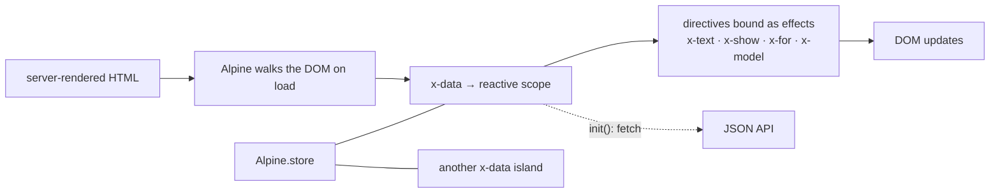

# Alpine.js

Written against Alpine 3. Behaviour is declared in HTML attributes and the
15 kB script sweeps the DOM on load — no build step, no components, and the
markup stays server-rendered. It fills the niche jQuery used to.

## What it is

Alpine assumes the page already exists. A server (or a static file) produces
the HTML; Alpine walks that HTML on load, finds elements carrying `x-data`,
turns each one's object literal into reactive state, and binds the other
directives inside it — `x-text`, `x-show`, `x-model`, `x-for` — to that state.
When a value changes, the directives that read it update.

That is the same contract jQuery had — the document is the application, and
scripts decorate it — with one difference that matters: the binding is
declarative, so there is no imperative code walking the DOM to keep it in sync
with a variable. What Alpine does not do is render pages, own routing, or fetch
data on your behalf.

Against the neighbours: [`stimulus`](../stimulus/) covers the same ground with
JavaScript classes instead of attribute expressions, and is stricter about
where logic lives; [`htmx`](../htmx/) removes browser state entirely by having
the server send new HTML. Alpine is the option that keeps a little state in the
browser and writes it next to the markup it affects.

## Characteristics

- **What it is good at.** Small, local interactivity — dropdowns, modals,
  tabs, filters, toggles — added to server-rendered pages without introducing a
  build pipeline or a second rendering model.
- **What it is not good at.** Anything large. Attribute expressions are
  strings: no type checking, no editor navigation, no refactoring tools, and no
  useful stack traces. `fetch-users.html` here shows where the ceiling is —
  once logic outgrows one expression it has to move into `Alpine.data`.
- **Runtime behaviour.** State is a reactive proxy; directives are effects that
  re-run when what they read changes. Each `x-data` block is an independent
  scope, so two blocks on a page share nothing unless a store connects them.
- **Development experience.** Nothing to install, nothing to compile, and the
  behaviour is visible in the markup it belongs to. Debugging is the weak
  point; there is a devtools extension, but errors in expressions surface as
  console messages without much context.
- **Ecosystem.** Small and first-party: official plugins for persistence,
  intersection, masking, focus trapping, and morphing. Alpine is also the
  browser half of the Laravel Livewire stack, which is where much of its use
  comes from.
- **Learning cost.** The lowest here. A developer who knows HTML and
  JavaScript expressions is productive immediately.
- **Operations.** One `<script defer>` tag from a CDN, or one dependency in an
  asset pipeline. The default build evaluates expressions with `new Function`,
  so a strict Content-Security-Policy needs Alpine's separate CSP build — the
  one real deployment constraint.

## Files

- `counter.html` — `x-data`, `x-text`, `x-on` (`@click`), `x-show`.
- `todo.html` — `x-for` over an array in `x-data`, `x-model` two-way binding,
  `x-effect` for a side effect.
- `fetch-users.html` — `x-init` with an async fetch, plus `Alpine.store()` for
  state shared between two separate `x-data` islands.

## Running

Open the files in a browser; Alpine comes from a CDN. There is no build, no dev
server, and no production step beyond serving the HTML — in a real project the
same script tag sits in whatever template the server renders.

## What the samples demonstrate

The three files are ordered by how much structure the state needs, which is the
decision Alpine forces on every feature.

- `counter.html` demonstrates the smallest form: state as an object literal in
  the attribute, including a getter (`doubled`) that re-evaluates when what it
  reads changes. The second `x-data` block on the page exists to show scope —
  two components, two independent states, no coordination. The `defer` on the
  script tag is called out because Alpine walks the DOM as soon as it loads.
- `todo.html` demonstrates the list case: `x-for` on a `<template>` with
  `:key`, `x-model` two-way binding on both the draft input and each checkbox,
  and `x-effect` for a side effect that re-runs when the data it reads changes.
  The state has outgrown an attribute here, so it moves into `Alpine.data`
  registered on the `alpine:init` event — the pattern any non-trivial Alpine
  component uses.
- `fetch-users.html` demonstrates two things at once: asynchronous
  initialisation through the component's `init()` method, and `Alpine.store` as
  the way two unrelated `x-data` islands share state. The comment at the top
  records the constraint behind all of this — `x-data` holds an *expression*,
  so a `try`/`catch` cannot go there, and that is the signal to move the logic
  into a component.

Deliberately absent: a server, routing, and any build. In a real deployment the
HTML around these directives is produced by Laravel, Rails, Django, or a static
site generator, and Alpine only adds the interaction on top. Growing this
further usually means adding the persistence or intersection plugins — or
concluding that the page wants a component framework after all.

## How the pieces connect

There is no virtual DOM and no template: the document *is* the template, which
is why Alpine can be added to a page it did not produce.

## Use cases

- **Server-rendered applications needing sprinkles of interactivity.** Laravel,
  Rails, Django, or any templating stack; this is the primary case.
- **Static sites with a few interactive controls.** Menus, filters, and
  disclosure widgets without shipping a framework.
- **Prototypes and internal pages.** No toolchain to set up.
- **Single-page applications.** Poor fit: no routing, no component reuse across
  pages, and attribute expressions do not survive that scale.
- **Applications with strict CSP and no build pipeline.** Needs the CSP build
  and the restrictions that come with it.

## Strengths and weaknesses

| | |
| --- | --- |
| Strengths | Zero build and one script tag; behaviour lives beside the markup it affects; reactive without a framework; smallest learning curve here |
| Weaknesses | Expressions in attributes get no typing, tooling, or refactoring support; state does not compose beyond stores; poor debugging story; default build needs `unsafe-eval` under CSP |
| Suits | Server-rendered pages, small interactions, teams whose main language is not JavaScript |
| Does not suit | Large client applications, anything needing routing or shared component logic, codebases where type safety is a requirement |

## History and adoption

- Created by Caleb Porzio and first published in December 2019, explicitly as a
  modern replacement for the "sprinkle jQuery on a page" pattern. Alpine 3
  (2021-06) is the current line, and `alpinejs@3.16.1` was the `latest` tag on
  npm on 2026-08-13.
- Development is by the author and contributors, funded through sponsorship.
  Alpine is closely associated with the Laravel ecosystem, where it is the
  browser-side half of Livewire, and with Tailwind-styled projects — the
  clearest documented pattern of its use.
- It appears in front-end surveys well below the component frameworks, which is
  consistent with its scope: it is not competing to build applications.

## References

- [alpinejs.dev](https://alpinejs.dev/) — documentation and directive reference
- [Alpine.data and Alpine.store](https://alpinejs.dev/globals/alpine-data)
- [alpinejs/alpine](https://github.com/alpinejs/alpine) — source and changelog
