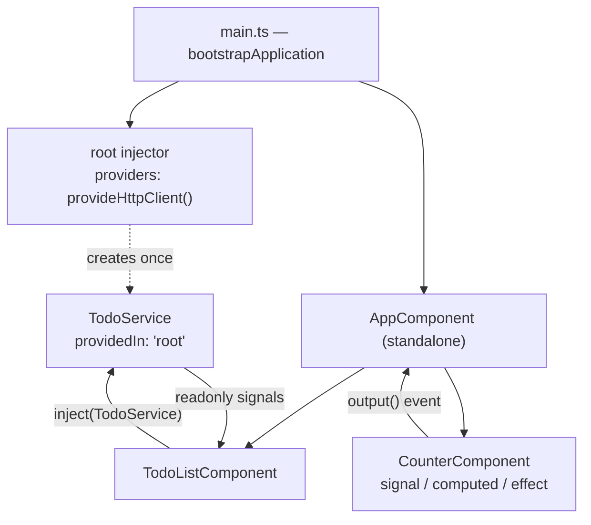

# Angular

Written against Angular 22. Two things changed the shape of Angular code since
the NgModule era, and both are used here: standalone components (the default —
no `@NgModule`, dependencies listed on the component itself) and signals for
reactive state.

## What it is

Angular is a complete application framework rather than a view library: it
ships routing, HTTP, forms, testing, internationalisation, a build system, and
a dependency injection container, all versioned together and all from one
vendor. Where React asks a team to assemble a stack, Angular hands one over and
expects the team to work inside it.

Dependency injection is the idea the rest is built on. A component does not
construct its collaborators; it asks the injector for them by type, and the
injector decides which instance to hand over — the real one in production, a
stub in a test, a different one under a different route. `todo.service.ts` and
`todo-list.component.ts` in this directory are that pattern in miniature.

The second idea, newer, is signals. Angular's change detection historically
walked the component tree whenever anything might have changed, coordinated by
Zone.js monkey-patching the browser's asynchronous APIs. Signals replace that
with explicit tracked values, so the framework knows exactly which views depend
on which state. The samples here use signals throughout and never mention
Zone.js.

## Characteristics

- **What it is good at.** Structure that survives size and turnover. Modules
  and injectors give real boundaries, the CLI generates code in one shape, and
  `ng update` runs codemods that carry a codebase across major versions — a
  genuine operational advantage over frameworks where upgrading is a manual
  read of a migration guide.
- **What it is not good at.** Starting small. The concept count before a first
  screen — decorators, injectors, providers, change detection, the CLI's
  workspace layout — is the highest in this directory, and the baseline bundle
  is larger than Svelte's or Solid's.
- **Runtime behaviour.** Templates compile ahead of time (the Ivy compiler).
  With signals and `OnPush`, updates are scoped to the views that read the
  changed signal instead of a tree walk.
- **Development experience.** TypeScript is not optional, templates are type
  checked against the component class, and the CLI covers scaffolding, dev
  server, build, and test. Errors are verbose but usually point at the real
  cause.
- **Ecosystem.** Large and mostly first-party: Angular Material, the router,
  forms, and HTTP client are all maintained with the framework. RxJS remains
  pervasive in existing codebases even though new APIs are signal-based.
- **Learning cost.** The highest here. Decorator metadata, injection scopes,
  and the two reactive models (RxJS observables and signals) coexisting in real
  projects are all subjects in their own right.
- **Operations.** A predictable major every six months with a published support
  window, which is why Angular tends to win in organisations that plan upgrades
  years ahead. Server rendering is available through `@angular/ssr`.

## Files

- `main.ts` — bootstrapping without an AppModule.
- `counter.component.ts` — `signal` / `computed` / `effect`, signal-based
  `input()` and `output()`.
- `todo.service.ts` — a root-provided service exposing readonly signals.
- `todo-list.component.ts` — `inject()` instead of a constructor parameter, and
  the built-in control flow blocks `@for` / `@if` / `@empty`.

## Running

    npm install -g @angular/cli
    ng new angular-demo --style=css
    cd angular-demo
    cp ../*.ts src/          # all four together: main.ts imports the others
                             # by relative path, and src/main.ts is the entry
                             # point the CLI builds
    ng serve

`ng build` writes an optimised bundle to `dist/`, and the result is static
files unless server rendering was enabled at scaffold time. The generated
`src/app/` from `ng new` is left unused by this sample.

## What the samples demonstrate

The four files are one small application showing how Angular's pieces meet:
bootstrap, a component with its own state, a service holding shared state, and
a component that consumes it.

- `main.ts` shows what replaced `@NgModule`. `bootstrapApplication` takes the
  root component and a providers array — the providers that used to live in a
  module, such as `provideHttpClient()`, are passed here. The root component
  lists what it uses in `imports`, so nothing is globally available and an
  unused component can be dropped by the bundler.
- `counter.component.ts` shows signals as component state: `signal` for
  writable state, `computed` for derived, `effect` for the side effect, plus
  the signal-based `input()` and `output()` that replaced the `@Input()` and
  `@Output()` decorators. Note that a signal is *called* in a template —
  `count()`, not `count` — which is the single most common Angular signal
  mistake.
- `todo.service.ts` shows the service pattern that makes state shareable:
  `providedIn: 'root'` for a lazily created application-wide singleton, a
  private writable signal, and a public `asReadonly()` view. Callers can read
  and subscribe but can only change the state through the methods — the same
  encapsulation a store library provides, with no library.
- `todo-list.component.ts` shows consumption: `inject()` in a field
  initialiser instead of a constructor parameter, and the built-in control flow
  blocks. `@for` requires `track`, unlike the optional `trackBy` of the old
  `*ngFor`, and `@empty` covers the empty-list branch.

Deliberately absent: the router, forms (`ReactiveFormsModule` or the newer
signal forms), HTTP calls — `provideHttpClient()` is registered but nothing
injects `HttpClient` — testing, and lazy loading. A real application adds
routes with lazily loaded components, an interceptor for auth, forms with
validation, and unit tests through `TestBed`, which is where dependency
injection pays for itself.

## How the pieces connect

Data flows down as signal inputs and up as `output()` events between
components, and sideways through the injector for anything shared. There is no
server in this sample; `provideHttpClient()` only shows where one would be
configured.

## Use cases

- **Long-lived enterprise applications.** Where the codebase outlives the team
  that wrote it, enforced structure and scripted upgrades matter more than
  bundle size.
- **Large internal tools and admin consoles.** Forms, tables, and role-based
  routing are all covered by first-party pieces.
- **Applications maintained by several teams.** Injection scopes and module
  boundaries make ownership explicit.
- **Marketing pages and content sites.** Poor fit: heavy for what is mostly
  static HTML. Use [`astro`](../astro/).
- **Small widgets embedded in another page.** Poor fit; use
  [`preact`](../preact/) or [`lit`](../lit/).

## Strengths and weaknesses

| | |
| --- | --- |
| Strengths | Everything included and versioned together; dependency injection makes testing and substitution routine; `ng update` migrations across majors; strict typing including templates; predictable six-month release cadence |
| Weaknesses | Highest concept count and slowest start; larger baseline bundle; two reactive models (RxJS and signals) in circulation; conventions are hard to deviate from; a major every six months is upgrade work whether or not it is wanted |
| Suits | Medium to very large applications, regulated or long-support environments, teams that want one prescribed way |
| Does not suit | Prototypes, embedded widgets, content-first sites, teams that want to pick their own router and state library |

## History and adoption

- AngularJS (the 1.x line) was released by Google in 2010. Angular 2, released
  in September 2016, was a complete rewrite in TypeScript and a different
  framework sharing the name; the two are not compatible.
- Since v4 (2017-03) the project ships a major roughly every six months with a
  published support window — `@angular/core` reached v22 on 2026-06-03.
- The Ivy compiler (v9, 2020) made ahead-of-time compilation the default.
  Standalone components arrived in v14 (2022) and became the default in v19
  (2024). Signals arrived in v16 (2023), with signal-based `input()` and
  `output()` and the `@if`/`@for` control flow blocks following in the v17
  line (2023–2024) — everything this directory uses.
- Per the [Angular v22 announcement](https://blog.angular.dev/announcing-angular-v22-c52bb83a4664),
  v22 makes signal forms and the resource APIs stable and continues the move
  away from Zone.js that v21 began. `@angular/core@22.1.1` was the `latest` tag
  on npm on 2026-08-13.
- Developed and used by Google, which publishes the framework's roadmap and
  release schedule on [angular.dev](https://angular.dev/). Adoption skews to
  large organisations; the [2025 Stack Overflow Developer Survey](https://survey.stackoverflow.co/2025/technology)
  measures Angular well below React in usage among responding developers, with
  the separate AngularJS entry still declining.

## References

- [angular.dev](https://angular.dev/) — documentation
- [Angular signals guide](https://angular.dev/guide/signals)
- [Release practices and support policy](https://angular.dev/reference/releases)
- [angular/angular](https://github.com/angular/angular) — source and changelog
