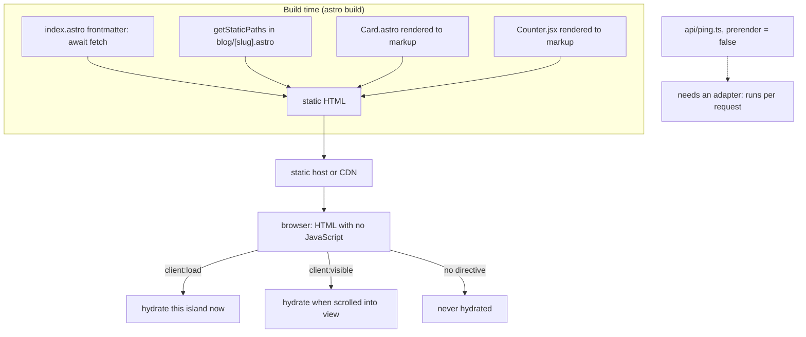

# Astro

Written against Astro 7. Pages render to HTML at build time and ship zero
JavaScript by default; interactive parts are opted in one component at a time
("islands"), and each island can come from a different framework.

## What it is

Astro inverts the assumption the other meta-frameworks here make. In Next.js,
Nuxt, and SvelteKit the application is a component tree that happens to be
rendered on the server first; in Astro the page is a document that happens to
contain a few interactive components. The default output is HTML with no
JavaScript at all, and every kilobyte of client code is something a `client:*`
directive explicitly asked for.

That is the islands architecture: independent interactive regions embedded in
static HTML, each hydrated on its own schedule — immediately, when idle, when
scrolled into view, or never. Because the islands are isolated, they do not
have to come from the same library, which is why `Counter.jsx` in this
directory is a Preact component inside an Astro page.

The `.astro` file format is the other half. Its frontmatter — the code between
the `---` fences — runs on the server (at build time for a static page) and
never in the browser, so `await fetch(...)` at the top of `index.astro` is
ordinary code with no client-side cost.

## Characteristics

- **What it is good at.** Content. Pages made mostly of text, images, and
  links, with a few interactive pieces, come out as small, fast HTML without
  effort.
- **What it is not good at.** Application shells. There is no client-side
  router by default, islands do not share state without an external store, and
  a screen that is interactive throughout is fighting the model.
- **Runtime behaviour.** Static by default: `astro build` writes HTML files.
  Adding an adapter enables server rendering per route (`export const prerender
  = false`), and server islands allow a dynamic region inside an otherwise
  cached page.
- **Development experience.** Vite-based, with a component syntax close to JSX
  but simpler — no hooks, no state, because `.astro` components do not run in
  the browser. Integrations (`npx astro add ...`) wire up UI frameworks, MDX,
  sitemaps, and adapters.
- **Ecosystem.** Growing and integration-shaped rather than component-shaped:
  the value is in adapters, content collections, and the ability to reuse
  components from other frameworks.
- **Learning cost.** Low for anyone who has written HTML and JSX. The concepts
  that need attention are the build-time/runtime boundary and which `client:*`
  directive to use.
- **Operations.** A static build deploys to any file host or CDN. With an
  adapter it becomes a server or edge deployment; the choice is per project and
  reversible.

## Files

- `src/pages/index.astro` — frontmatter runs at build time, the template is
  HTML, and two islands are hydrated with different directives.
- `src/components/Card.astro` — props and `<slot>`, with styles scoped to the
  component.
- `src/components/Counter.jsx` — a Preact island: ordinary component code, made
  interactive only where `client:*` says so.
- `src/pages/blog/[slug].astro` — a dynamic route with `getStaticPaths`.
- `src/pages/api/ping.ts` — an endpoint exporting `GET` / `POST`.

## Running

    npm create astro@latest astro-demo
    cd astro-demo
    npx astro add preact          # for the island in Counter.jsx
    cp -r ../src/* src/
    npm run dev

`npm run build` writes static HTML to `dist/` and `npm run preview` serves it.
`src/pages/api/ping.ts` sets `export const prerender = false`, so it needs a
server: add an adapter (`npx astro add node`) before building, or it will be
skipped in a fully static build. The dev server runs it either way.

## What the samples demonstrate

Five files that between them show every boundary Astro introduces: build time
against request time, HTML against island, and static route against endpoint.

- `src/pages/index.astro` is the centre of the directory. The frontmatter
  fetches users at build time — top-level `await`, no loading state, nothing
  shipped to the browser — and the template then uses the same `Counter`
  component three ways: `client:load` (hydrated immediately), `client:visible`
  (hydrated when scrolled into view), and with no directive at all (rendered to
  HTML once, never hydrated, zero JavaScript). Those three lines are the
  clearest statement of what Astro is for.
- `src/components/Card.astro` shows the component model: typed `Props`,
  destructured from `Astro.props`, a default `<slot>` for children and a named
  slot with fallback content, and a `<style>` block scoped by a generated class
  so it cannot leak.
- `src/components/Counter.jsx` shows that an island is ordinary framework code.
  Nothing in the file knows about Astro; whether it becomes interactive is the
  caller's decision. The same file would work unchanged in a Preact project —
  see the [`preact`](../preact/) directory.
- `src/pages/blog/[slug].astro` shows the static dynamic route.
  `getStaticPaths` enumerates the pages to build, and passing `props` alongside
  `params` means the page template needs no second fetch. The comment records
  what changes in server output mode: `getStaticPaths` is dropped and
  `Astro.params` is read per request instead.
- `src/pages/api/ping.ts` shows the endpoint role — one exported function per
  HTTP method returning a standard `Response` — and, through `prerender =
  false`, the exact point at which an Astro project stops being a pile of files
  and needs a server.

Deliberately absent: content collections (the typed Markdown/MDX pipeline that
most real Astro sites are built on), view transitions, image optimisation,
and any state shared between islands. A real site adds content collections for
its articles, an integration or two, and — if islands must talk to each other —
a small shared store, since they are separate component trees.

## How the pieces connect

The important line is the one from `CDN` to `BROWSER`: unless a directive says
otherwise, what arrives is a document, not an application.

## Use cases

- **Documentation, blogs, and marketing sites.** The primary case, and the one
  everything in the design serves.
- **Content sites with a few interactive widgets.** Search boxes, filters,
  calculators — each an island, each paid for individually.
- **Migrating a site between UI frameworks.** Islands from different
  frameworks can coexist on one page during a transition.
- **Dashboards and application shells.** Poor fit: no client router by default
  and no shared state between islands. Use [`nextjs`](../nextjs/),
  [`nuxt`](../nuxt/), [`sveltekit`](../sveltekit/), or
  [`reactrouter`](../reactrouter/).
- **JSON APIs.** Endpoints exist, but a dedicated server framework is the
  better tool.

## Strengths and weaknesses

| | |
| --- | --- |
| Strengths | Zero JavaScript by default with per-component opt-in; components from React, Vue, Svelte, Preact, Solid, or Lit in one page; static output deploys anywhere; low learning cost |
| Weaknesses | Not designed for stateful application shells; islands are isolated, so shared state needs an external store; server rendering and endpoints require an adapter; a fast-moving major release cadence |
| Suits | Content-first sites, documentation, marketing, blogs, e-commerce catalogue pages |
| Does not suit | Highly interactive applications, anything wanting a client-side router by default, teams that want one framework for everything |

## History and adoption

- Started in 2021 and released as 1.0 on 2022-08-09. Content collections
  arrived in 2.0 (2023), view transitions in 3.0 (2023), and the content layer
  and server islands in 5.0 (2024-12).
- Astro 7.0 was released on 2026-06-22; per the
  [release post](https://astro.build/blog/astro-7/) it rewrites the `.astro`
  compiler in Rust, moves to Vite 8, and stabilises route caching.
  `astro@7.2.1` was the `latest` tag on npm on 2026-08-13, roughly seven weeks
  after 7.0 — the release cadence here is faster than any other directory's.
- Maintained by the Astro Technology Company under an MIT licence, with public
  release notes and RFCs.
- Adoption is most visible in documentation and content sites, including a
  number of well-known open-source projects' own documentation; the framework
  publishes a case-study section rather than being measured in application
  surveys.

## References

- [docs.astro.build](https://docs.astro.build/) — documentation
- [Islands architecture](https://docs.astro.build/en/concepts/islands/)
- [Rendering modes and adapters](https://docs.astro.build/en/guides/on-demand-rendering/)
- [withastro/astro](https://github.com/withastro/astro) — source and changelog
