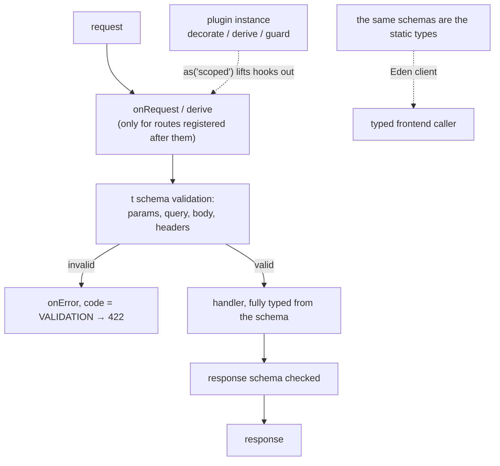

# Elysia

Written against Elysia 1.4 on Bun. The point of interest is the type system:
schemas declared with `t` validate at runtime *and* narrow the handler's types,
so `body` and `params` are typed without a generic or a cast anywhere.

## What it is

Every framework in this directory that validates input has two descriptions of
the same data: a runtime schema and a TypeScript type, kept in step by hand or
by a code generator. Elysia collapses them. `t.Object({ text: t.String() })` is
a TypeBox schema — a real JSON Schema object used to validate the request — and
the handler's `body` is typed from it by inference. There is no generic
parameter, no `as`, and no way for the two to drift apart.

That inference is why the API is a method chain. Each `.get()` or `.post()`
returns a new instance whose *type* carries everything registered so far;
assigning to a variable and calling methods separately throws that information
away. The chain is load-bearing, not stylistic, and it is the first thing to
know about the framework.

The second is Bun. Elysia targets Bun's runtime and its performance work
assumes it — handlers are compiled from static analysis of the code — and it is
the framework that made the Bun ecosystem look like a place to build servers.
`@elysiajs/node` exists for Node deployments at the cost of the Bun-specific
fast paths.

Against the neighbours: [`hono`](../hono/) is the portable option built on web
standards, [`fastify`](../fastify/) is the schema-first Node option, and Elysia
is the one where the schema is also the static type.

## Characteristics

- **What it is good at.** End-to-end type safety with almost no annotation.
  With the Eden client, the same route types can be consumed by a frontend, so
  a changed response shape becomes a compile error in the caller.
- **What it is not good at.** Being conservative. It is the youngest project
  here, the ecosystem is small, and the type-level machinery can slow the
  TypeScript language server down in a large codebase.
- **Runtime behaviour.** Validation runs before the handler and produces a 422
  by default. Lifecycle hooks — `onRequest`, `derive`, `onError` — apply to
  what is registered *after* them, and plugin scope (`.as('scoped')`,
  `.as('global')`) decides how far they reach. Both rules are visible in
  `plugin.ts` and `validation.ts`.
- **Development experience.** Very little boilerplate, immediate feedback under
  `bun --hot`, and errors that point at the schema. The chaining rule and the
  hook-ordering rule are the two things that surprise newcomers.
- **Ecosystem.** Small and first-party: CORS, JWT, Swagger, static files,
  server-sent events, and the Eden client. Nothing like Express's or Fastify's
  breadth.
- **Learning cost.** Medium. The API is small; the type-driven parts are
  intuitive when they work and hard to debug when they do not.
- **Operations.** `bun run server.ts` in development, `bun run` the same file
  in production — there is no build step, since Bun runs TypeScript directly.
  That also means the deployment target must have Bun, or the Node adapter.

## Files

- `server.ts` — routing, typed params, method chaining. The chaining is not
  cosmetic: each `.get()` returns a new type carrying what was registered, so
  breaking the chain loses the inference.
- `validation.ts` — `t.Object` schemas on body, query, params, and response,
  plus the error hook that formats the failures.
- `plugin.ts` — plugins as composable instances, with `decorate`, `derive`,
  `guard`, and lifecycle hooks.

## Running

    bun add elysia
    bun run server.ts
    curl localhost:3000/users/1

Bun is the target runtime (`bun --hot server.ts` for reload). Node works via
`@elysiajs/node`, at the cost of the Bun-specific fast paths.

This directory has a `package.json` pinning `elysia@^1.4.29`, so `bun install`
with no arguments installs what the samples were written against.

## What the samples demonstrate

- `server.ts` demonstrates routing and the inference that comes with it. The
  `params: t.Object({ id: t.Number() })` schema both coerces `"1"` to a number
  at runtime and makes `id` a `number` in the handler; `set.status` and
  `set.headers` show the response-shaping API (`/teapot` returns 418 with a
  custom header). The comment at the top states the chaining rule the whole
  file depends on.
- `validation.ts` demonstrates schemas as the contract of a resource:
  `.model({ note: ... })` registers a named schema referenced by string, the
  `response` schema is enforced on the way out — an extra field is an error,
  not a silent leak — and `status(404, ...)` short-circuits with a typed error
  response. The `onError` hook is registered *before* the routes on purpose,
  and the comment says why: a hook applies to what comes after it, so the same
  handler placed at the end of the chain would never see these routes fail.
  That ordering rule is easy to get wrong and produces a handler that appears
  to do nothing.
- `plugin.ts` demonstrates composition. A plugin is just another Elysia
  instance: `database` uses `decorate` to add a value created once to every
  context and `derive` to compute a per-request value, `auth` derives a user
  from a header or returns 401, `guard` applies a schema to a group of routes
  at once, and `group` mounts routes under a prefix. `.as('scoped')` is what
  lifts a hook out of the plugin that declared it, and the `name` option
  deduplicates a plugin used from several places.

Deliberately absent: a database, real authentication, and the Eden client that
would consume these types from a frontend. A real service adds a persistence
layer, `@elysiajs/jwt` or similar, `@elysiajs/swagger` to publish the schemas
it already has, and Eden if a TypeScript client exists.

## How the pieces connect

The dotted line on the right is the property that distinguishes Elysia: one
declaration serves the validator, the handler's types, and the client's types.

## Use cases

- **Typed APIs consumed by a TypeScript frontend.** With Eden, the contract is
  checked at compile time on both sides.
- **Services already running on Bun.** Elysia is the most developed server
  framework in that runtime.
- **Internal services and prototypes where iteration speed matters.** No build
  step, minimal ceremony, validation included.
- **Long-lived enterprise systems.** The project is young and has moved fast;
  [`nestjs`](../nestjs/) or [`fastify`](../fastify/) are the conservative
  choices.
- **Deployments where Bun is not available.** The Node adapter works, but then
  [`hono`](../hono/) or Fastify are the more natural fits.

## Strengths and weaknesses

| | |
| --- | --- |
| Strengths | One schema is the runtime validator and the static type; end-to-end typing to the client through Eden; very little boilerplate; no build step on Bun |
| Weaknesses | Bun-first, with the Node path giving up its fast paths; small ecosystem and short history; heavy type-level inference can slow the TypeScript language server; two non-obvious rules (unbroken chaining, hook registration order) that fail quietly when violated |
| Suits | Bun services, typed internal APIs, small to medium teams that value inference over configuration |
| Does not suit | Node-only infrastructure, large legacy codebases, organisations that require a long-established framework |

## History and adoption

- Created by the developer known as SaltyAom; the `elysia` package first
  appeared on npm in December 2022, alongside Bun's own rise, and 1.0 was
  released on 2024-03-16 after roughly eighteen months of development.
- `elysia@1.4.29` was the `latest` tag on npm on 2026-08-13, with a 2.0 line
  published under the `next` tag. The samples here target 1.4.
- The project is community-run and MIT licensed; its blog documents each minor
  release, and the 1.0 post is the clearest statement of its goals.
- Adoption is concentrated in the Bun ecosystem, which is younger and smaller
  than Node's. There is no survey evidence of broad enterprise use, and this
  directory does not claim any.

## References

- [elysiajs.com](https://elysiajs.com/) — documentation
- [Validation and the `t` schema builder](https://elysiajs.com/essential/validation)
- [Plugins and scope](https://elysiajs.com/essential/plugin)
- [elysiajs/elysia](https://github.com/elysiajs/elysia) — source and changelog
