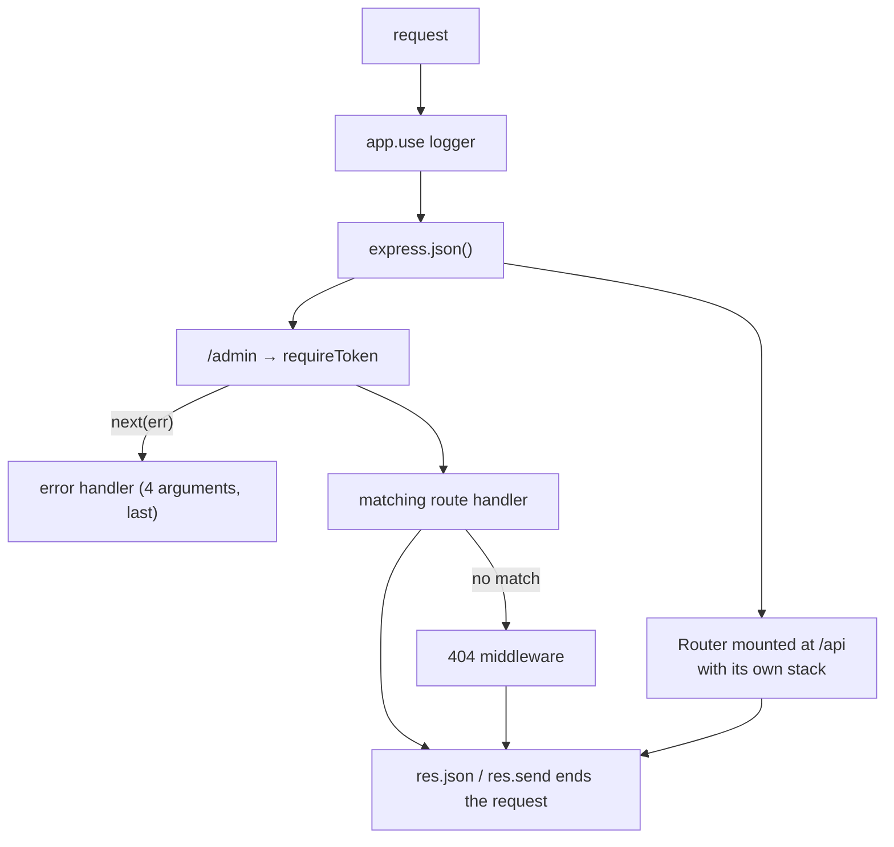

# Express

Written against Express 5. The version matters: in Express 5 a rejected promise
from an async handler reaches the error middleware on its own, so the
`try/catch { next(err) }` wrapper every Express 4 codebase carried is gone.
Path patterns changed too — `/files/*` is now `/files/*splat`.

## What it is

Express is a router and a middleware chain. A request enters at the top,
passes through the functions registered with `app.use()` and the route handlers
that match, and one of them ends it by sending a response. That is the entire
model, and it has not changed since 2010.

Everything else — body parsing, sessions, authentication, validation,
templating, CORS — is a middleware someone else wrote. This is why Express is
simultaneously the easiest framework here to start with and the hardest to
maintain at size: nothing is provided, nothing is enforced, and two Express
applications can share no structure whatsoever.

Its position today is that of a default. It is the framework most Node
tutorials, courses, and answers assume; a very large amount of deployed Node
code runs on it; and most alternatives, including [`fastify`](../fastify/) and
[`nestjs`](../nestjs/), define themselves in relation to it.

## Characteristics

- **What it is good at.** Being known. Any problem has been solved publicly,
  any middleware exists, and any developer with Node experience can read the
  code without introduction.
- **What it is not good at.** Anything the framework could have done for you:
  input validation, response typing, module boundaries, structured logging,
  and lifecycle management are all left open.
- **Runtime behaviour.** Handlers receive Node's `req`/`res` directly. Order of
  registration is the control flow: a middleware either ends the request or
  calls `next()`, and the error handler is whichever function takes four
  arguments, placed last.
- **Development experience.** Minimal ceremony, immediate feedback, and no
  build step. TypeScript support is community-maintained types over a
  JavaScript API rather than a designed-in feature.
- **Ecosystem.** The largest of any Node framework, with the caveat that a
  large part of it is old. Middleware that has not been updated in years is
  common, and evaluating it is part of the work.
- **Learning cost.** The lowest here.
- **Operations.** A plain Node process. Graceful shutdown, logging, metrics,
  and configuration are all assembled from other packages.

## Files

- `server.js` — routing, params, static files, async handlers.
- `middleware.js` — the request pipeline: order, `next()`, scoped mounting,
  and the four-argument error handler.
- `rest-api.js` — a CRUD router with validation and correct status codes.

## Running

    npm install express
    node server.js
    curl localhost:3000/users/1

`package.json` here sets `"type": "module"` so the files can use `import`, and
pins `express@^5.2.1`; `npm install` with no arguments installs that. There is
no build step, and production is the same command behind a process manager or
a reverse proxy.

## What the samples demonstrate

The three files are the three things Express actually is: routes, a pipeline,
and a mountable router.

- `server.js` demonstrates routing plus the two Express 5 changes worth
  knowing. Body parsers are built in (`express.json()`, no `body-parser`
  dependency), the wildcard route is now named (`/files/*splat`, read back as
  `req.params.splat`), and `/remote` is an async handler whose rejection
  reaches the error middleware without a `try`/`catch` — the single most
  useful thing Express 5 changed. `app.route('/notes')` shows methods chained
  on one path.
- `middleware.js` demonstrates the pipeline in the order it executes: a
  logging middleware that hooks `res.on('finish')` because timing must survive
  the rest of the chain; `express.json()`; a token check mounted on `/admin`
  that passes an error to `next()` to jump straight to the error handler;
  per-route middleware (`slowDown(500)`); a `Router` with its own stack mounted
  at `/api`; a catch-all 404 reached only when nothing above ended the request;
  and the four-argument error handler last, because its position is what makes
  it an error handler.
- `rest-api.js` demonstrates a resource as a mountable `Router`.
  `router.param('id', ...)` resolves the note once for every route carrying that
  parameter, so the handlers can assume `req.note` exists — Express's answer to
  repeated lookup code. The status codes are chosen deliberately: 422 rather
  than 400 when the JSON parsed but the content was wrong, 201 with a
  `Location` header on create, 204 on delete.

Deliberately absent: validation (the checks are hand-written `typeof` tests),
authentication beyond a hard-coded token, a database, logging, and tests. A
real service adds a validation library, a session or JWT middleware, helmet and
rate limiting, structured logging, and graceful shutdown — all of which the
other server directories here provide out of the box.

## How the pieces connect

Registration order is the only control flow. There is no lifecycle, no scope,
and no schema anywhere in this diagram — which is both the appeal and the
limitation.

## Use cases

- **Small services and prototypes.** Fewest concepts between an idea and a
  running endpoint.
- **Existing Node codebases.** The realistic case for most Express work today:
  maintaining or extending what is already there.
- **Glue services.** Webhook receivers, proxies, and internal endpoints where
  the framework should be invisible.
- **Large APIs with strict contracts.** [`fastify`](../fastify/) or
  [`nestjs`](../nestjs/) provide the validation and structure Express does not.
- **Edge or Workers runtimes.** Express assumes Node's `http`; use
  [`hono`](../hono/).

## Strengths and weaknesses

| | |
| --- | --- |
| Strengths | Ubiquitous knowledge and middleware; smallest possible learning curve; no build step or configuration; Express 5 finally handles async rejections |
| Weaknesses | No validation, typing, structure, or lifecycle; middleware quality and maintenance vary widely; performance below Fastify and Hono; large codebases diverge because nothing is enforced |
| Suits | Prototypes, small services, teams maintaining existing Express applications |
| Does not suit | Large APIs needing enforced contracts, edge deployments, teams wanting first-class TypeScript |

## History and adoption

- Created by TJ Holowaychuk in 2010, modelled on Sinatra. Express 4 (2014-04)
  was the stable line for a decade.
- Express 5.0.0 was published to npm in September 2024 and announced on the
  project blog in [October 2024](https://expressjs.com/en/blog/2024-10-15-v5-release/).
  The delay is part of the project's history: development stalled for years
  under a single maintainer, and the release followed a governance rebuild
  under the OpenJS Foundation with a technical committee. `express@5.2.1` was
  the `latest` tag on npm on 2026-08-13.
- Express is an OpenJS Foundation project. Its own documentation and the
  foundation's posts are the primary record of the v5 effort and the governance
  changes around it.
- On adoption: Express appears among the most-used web technologies in the
  [2025 Stack Overflow Developer Survey](https://survey.stackoverflow.co/2025/technology),
  and it remains the framework most Node middleware is written for — including
  [`nestjs`](../nestjs/), which uses it as its default HTTP adapter.

## References

- [expressjs.com](https://expressjs.com/) — documentation
- [Migrating to Express 5](https://expressjs.com/en/guide/migrating-5.html)
- [expressjs/express](https://github.com/expressjs/express) — source and changelog
