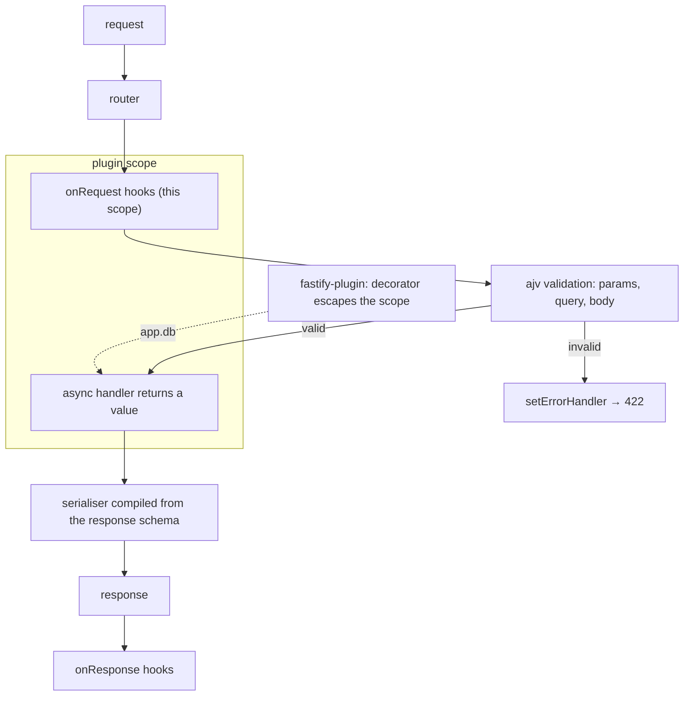

# Fastify

Written against Fastify 5. The distinguishing feature is JSON Schema on every
route: it validates input, and Fastify compiles the response schema into a
fast serialiser instead of calling `JSON.stringify`.

## What it is

Fastify is a Node HTTP framework built around two ideas that Express does not
have: schemas and encapsulation.

**Schemas.** A route declares the shape of its query string, body, params, and
responses as JSON Schema. Incoming data is validated by a compiled `ajv`
validator before the handler runs, so the handler can assume its input is
correct. Outgoing data goes through a serialiser compiled from the response
schema, which is faster than generic `JSON.stringify` and — more importantly —
cannot emit a field the schema does not mention. A password column added to a
database row does not silently appear in an API response.

**Encapsulation.** A plugin is a scope. Routes, hooks, and decorators
registered inside it are invisible outside it, so two parts of an application
cannot accidentally share a hook or a decorator. Opting out of that isolation
is explicit — the `fastify-plugin` wrapper — which is the inverse of Express,
where everything is global by default and isolation takes effort.

The name is about throughput, and the project publishes benchmarks, but the
schema and plugin models are what change how code is written.

## Characteristics

- **What it is good at.** Services where the contract matters. Schemas are the
  contract, and they double as validation, serialisation, and (through
  `@fastify/swagger`) generated OpenAPI documentation.
- **What it is not good at.** Being picked up in five minutes. Encapsulation is
  the concept that trips people up — a decorator that "does not exist" in a
  sibling plugin is the characteristic first bug.
- **Runtime behaviour.** Handlers are async and return values; throwing is
  enough to produce an error response, with no `next(err)`. Hooks
  (`onRequest`, `preHandler`, `onResponse`, `onClose`) run in a fixed order
  within their scope. Logging is `pino`, built in and structured from the
  start.
- **Development experience.** Good errors, a clear plugin lifecycle, and
  first-class TypeScript through type providers that derive handler types from
  the schemas. The cost of the schema-first style is verbosity for simple
  routes.
- **Ecosystem.** A large, mostly first-party plugin set — CORS, JWT, cookies,
  static files, rate limiting, multipart, Swagger, WebSockets — maintained
  under the same organisation.
- **Learning cost.** Medium. Routes and hooks are familiar; encapsulation,
  `fastify-plugin`, and schema references (`$ref`) are the material that needs
  reading.
- **Operations.** A plain Node process. `app.close()` shuts down listeners,
  in-flight requests, and plugin teardown in reverse registration order, which
  is what makes graceful restarts straightforward.

## Files

- `server.js` — routes, params, async handlers, graceful shutdown.
- `schema-validation.js` — request and response schemas, and a custom error
  handler that turns validation failures into a useful body.
- `plugin.js` — encapsulation: a plugin is a scope, and `fastify-plugin` is
  what opts out of it when a decorator should be visible to the parent.

## Running

    npm install fastify fastify-plugin
    node server.js
    curl localhost:3000/users/1

This directory has a `package.json` pinning what the samples were written
against (`fastify@^5.12.0`, `fastify-plugin@^5.1.0`), so `npm install` with no
arguments installs those versions. There is no build step; production is the
same `node server.js` under a process manager, with the logger left at its
default JSON output.

## What the samples demonstrate

- `server.js` demonstrates the request lifecycle. Async handlers return the
  body rather than calling `res.send`, `reply.code(400).send(...)` covers the
  cases that need an explicit status, and the `onRequest`/`onResponse` hook
  pair shows where cross-cutting work belongs. The `SIGINT`/`SIGTERM` loop
  calling `app.close()` is the graceful shutdown that a container orchestrator
  expects.
- `schema-validation.js` demonstrates the framework's central feature.
  `addSchema` registers a shared definition referenced by `$ref` from several
  routes; the body schema rejects a missing `text` and strips unknown keys
  (Fastify configures `ajv` with `removeAdditional`); the query schema coerces
  `"true"` to a boolean; and the response schema compiles into the serialiser.
  The comment states the part that is easy to miss — the response schema is not
  a check but a filter, and it is what stops an unintended field leaking. The
  custom `setErrorHandler` turns `error.validation` into a 422 with a readable
  list, since the default 400 body is rarely what an API wants to expose.
- `plugin.js` demonstrates encapsulation from both sides. `apiRoutes` is a
  plain plugin registered twice under different prefixes — the same routes at
  `/v1` and `/v2`, each with its own hook — while `database` is wrapped in
  `fp()` so its `app.decorate('db', ...)` escapes into the parent scope and can
  be used by `/health`, which is registered outside the plugin. The `onClose`
  hook shows where connection teardown belongs.

Deliberately absent: a real database, authentication, and OpenAPI generation. A
production service registers `@fastify/swagger` to publish the schemas it
already has, `@fastify/jwt` or similar for auth, and a database plugin
following the `plugin.js` pattern.

## How the pieces connect

## Use cases

- **JSON APIs on Node with a defined contract.** The core case: schemas
  validate, serialise, and document one description.
- **Services where throughput matters.** The compiled serialiser and the
  router are where the performance claims come from.
- **Applications assembled from independent modules.** Encapsulation gives
  each feature a real boundary, and prefixes make versioned mounting trivial.
- **Serving HTML or a UI.** Possible with a view plugin, but the
  meta-framework directories are the right tools.
- **Edge or Workers deployment.** Fastify is Node-shaped; use
  [`hono`](../hono/).

## Strengths and weaknesses

| | |
| --- | --- |
| Strengths | Schemas validate input, speed up output, and prevent field leaks; plugin encapsulation gives real module boundaries; structured logging and graceful shutdown built in; large first-party plugin set |
| Weaknesses | Encapsulation is the main source of confusion for newcomers; JSON Schema is verbose next to a TypeScript type (type providers help); Node-only; more setup than Express for a two-route service |
| Suits | Medium to large Node services, teams that want an enforced request/response contract, APIs that must publish OpenAPI |
| Does not suit | Throwaway scripts, edge runtimes, teams unwilling to write schemas |

## History and adoption

- Started in 2016 by Matteo Collina and Tomas Della Vedova, with 1.0 released
  in March 2018. The stated goal from the beginning was low per-request
  overhead.
- Fastify joined the OpenJS Foundation as an incubating project and graduated
  around the v3 release in 2020; it is now an At-Large project there, with
  several lead maintainers and a published governance model.
- Fastify 5 (2024-09) is the current line, and `fastify@5.12.0` was the
  `latest` tag on npm on 2026-08-13.
- Adoption is easiest to observe through its role elsewhere in the ecosystem:
  [`nestjs`](../nestjs/) ships a Fastify adapter as the alternative to Express,
  and the framework is a common choice for Node services where Express's lack
  of validation becomes a maintenance cost.

## References

- [fastify.dev](https://fastify.dev/) — documentation
- [Validation and serialization](https://fastify.dev/docs/latest/Reference/Validation-and-Serialization/)
- [Plugins and encapsulation](https://fastify.dev/docs/latest/Reference/Plugins/)
- [fastify/fastify](https://github.com/fastify/fastify) — source and changelog
