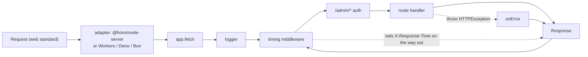

# Hono

Written against Hono 4. A small router built on the web standard `Request` /
`Response`, so the same code runs on Node, Bun, Deno, Cloudflare Workers, and
the rest — only the adapter at the bottom of the file changes.

## What it is

Express and Fastify are built on Node's `http` module: their handlers receive
Node's `req` and `res` objects, and that ties them to Node. Hono is built on
the `Request` and `Response` objects the browser and every modern server
runtime share. A Hono application is, at bottom, a function from a `Request` to
a `Response` — `app.fetch` — which is exactly the interface Cloudflare Workers,
Deno, and Bun expect.

The consequence is portability without a compatibility layer. The three sample
files here run under Node through `@hono/node-server`; on Bun or Deno the same
files work with `export default app` instead, and on Workers the same again.
Nothing else in this directory has that property.

Hono is deliberately small: a router, a context object, middleware, and a set
of optional built-ins (JWT, CORS, compression, caching, JSX, validators). It
does not have an opinion about how an application should be structured, which
makes it the closest thing here to "Express for the standards era".

## Characteristics

- **What it is good at.** Running the same code everywhere, and starting fast.
  There is no dependency tree to speak of, no build step, and no framework
  boot cost — which matters on platforms billed per invocation.
- **What it is not good at.** Deciding structure. Like Express, it gives a
  router and gets out of the way; validation, dependency wiring, and layering
  are the developer's problem.
- **Runtime behaviour.** Routing is the part the project optimises hardest —
  several router implementations exist and Hono picks between them — and the
  middleware model is the onion familiar from Koa: everything before `await
  next()` runs on the way in, everything after on the way out, so a middleware
  can inspect and rewrite the response.
- **Development experience.** TypeScript-first with typed path parameters and
  context variables; `@hono/zod-validator` adds schema validation, and the RPC
  mode can generate a typed client from the routes. The samples here stay in
  plain JavaScript to keep the runtime requirements at zero.
- **Ecosystem.** Growing, and shaped as adapters and middleware packages rather
  than as a large plugin registry. Smaller than Express's or Fastify's.
- **Learning cost.** Low. If `Request`/`Response` and `async`/`await` are
  familiar, the whole API fits in an afternoon.
- **Operations.** Deploys as a Worker, a Deno or Bun service, a Node process,
  or a Lambda handler with only the entry point changing. That is unusual
  enough to be the main reason projects choose it.

## Files

- `basic.js` — routing, path and query params, JSON responses, status codes.
- `middleware.js` — the onion model: built-in logger, a custom timing
  middleware, scoped auth, and `onError` / `notFound`.
- `rest-api.js` — an in-memory CRUD resource with validation.

## Running

    npm install hono @hono/node-server
    node basic.js
    curl localhost:3000/users/1

`@hono/node-server` is the Node adapter; on Bun or Deno `export default app`
is enough.

This directory has a `package.json` pinning the versions the samples were
written against (`hono@^4.13.2`, `@hono/node-server@^2.1.0`), so plain
`npm install` in this directory installs exactly those. There is no build step
and no production command beyond running the file under a process manager or
deploying it to a platform's runtime.

## What the samples demonstrate

Three files, ordered as the concerns of a real service: routing, then
cross-cutting behaviour, then a resource.

- `basic.js` demonstrates the routing surface: path parameters
  (`c.req.param('id')`), query strings, wildcards, chained methods on one path,
  and `app.route('/admin', admin)` mounting a sub-application under a prefix.
  The handler contract is visible throughout — one context argument in, a
  `Response` out, with `c.json`/`c.text` as shorthands for building one.
- `middleware.js` demonstrates the onion. The timing middleware sets a header
  *after* `await next()`, which is only possible because the response is
  available on the way out. The auth middleware is mounted on `/admin/*`, so
  only those routes pay for it, and it passes data forward with `c.set('user',
  ...)`. `HTTPException` shows how a handler bails out mid-stack, and `onError`
  and `notFound` show the two catch-all hooks every service needs.
- `rest-api.js` demonstrates a CRUD resource with the status codes that matter:
  400 for a body that is not JSON, 422 for JSON that is the wrong shape, 201
  with a `Location` header on create, 404 on a missing id, and 204 with no body
  on delete. The comment points at `@hono/zod-validator` as what replaces the
  hand-written checks once the shapes grow — the Fastify and Elysia directories
  show what that looks like when the framework provides it.

Deliberately absent: a database, authentication beyond a hard-coded token,
configuration, and tests. A real service adds a validator, structured logging,
a data layer, and the platform adapter for wherever it will run.

## How the pieces connect

`app.fetch` is the whole integration point. Everything to the left of it is the
runtime, everything to the right is the application, and only the leftmost box
changes between platforms.

## Use cases

- **APIs on Cloudflare Workers or other edge runtimes.** The case Hono was
  written for, and where its startup cost and standards basis pay off.
- **Backends for frontends and small microservices.** Small dependency
  footprint, quick to start, easy to deploy.
- **Projects that may move between runtimes.** Node today, Bun or Workers
  later, without a rewrite.
- **Large layered applications.** Possible, but [`nestjs`](../nestjs/) provides
  the structure that Hono deliberately does not.
- **Node services needing schema-driven throughput.** [`fastify`](../fastify/)
  is the better fit; its serialiser compilation has no equivalent here.

## Strengths and weaknesses

| | |
| --- | --- |
| Strengths | One codebase across Node, Bun, Deno, and Workers; tiny and fast to start; standards-based API that transfers to other tools; typed routing and optional RPC client |
| Weaknesses | Small standard library — validation, logging, and structure are assembled by hand; smaller ecosystem than Express or Fastify; edge runtimes impose their own limits (no filesystem, restricted APIs) that the portability promise does not remove |
| Suits | Edge and serverless APIs, BFFs, microservices, teams comfortable assembling their own stack |
| Does not suit | Large enterprise codebases wanting enforced structure, teams relying on a deep middleware ecosystem |

## History and adoption

- Created by Yusuke Wada in December 2021, initially for Cloudflare Workers,
  because writing Workers without a router meant repetitive code. The name is
  the Japanese word for flame.
- Version 4 (2024-02) is the current line; `hono@4.13.2` was the `latest` tag
  on npm on 2026-08-13, published that same day, which is representative of the
  release pace.
- Wada joined Cloudflare in 2023 and works on Hono there; Cloudflare has
  published [the project's history from its creator](https://blog.cloudflare.com/the-story-of-web-framework-hono-from-the-creator-of-hono/)
  and documents Hono among its supported frameworks. The project itself remains
  MIT licensed and community-maintained.
- Adoption is concentrated where its portability matters — Workers, Deno, Bun,
  and serverless deployments — rather than in traditional Node hosting, where
  Express remains the default.

## References

- [hono.dev](https://hono.dev/) — documentation
- [Middleware and the context](https://hono.dev/docs/guides/middleware)
- [honojs/hono](https://github.com/honojs/hono) — source and changelog
