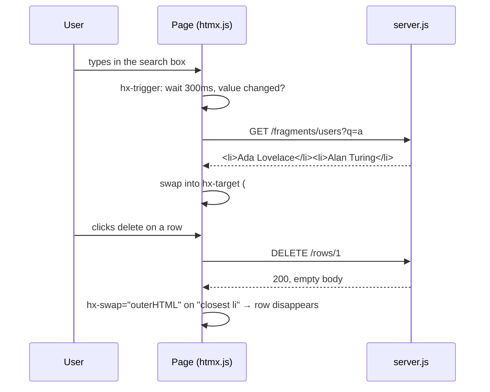

# htmx

Written against htmx 2. Any element can issue a request and swap the returned
HTML into the page, so the server keeps rendering HTML and the client keeps no
state. The opposite trade to the SPA frameworks in the sibling directories.

## What it is

HTML already has two elements that talk to a server and replace the page with
the result: `<a>` and `<form>`. htmx generalises that. Any element can make any
HTTP method's request, triggered by any DOM event, and the response — a
fragment of HTML — is placed anywhere in the document.

The argument behind it is that most of what a single-page application does is
re-implement, in JavaScript, things the browser already does, and then keep a
second copy of the application's state in the browser so it can render them.
If the server returns HTML instead of JSON, that second copy is unnecessary:
there is no client-side model to synchronise, no serialisation format to
design, and no rendering logic duplicated on both sides.

The cost is equally clear. Every interaction is a network round trip, the
server must be able to render fragments and not just pages, and interactions
that are genuinely local — dragging, drawing, offline editing — have no good
answer in this model.

Against the neighbours: [`stimulus`](../stimulus/) and [`alpinejs`](../alpinejs/)
also start from server-rendered HTML but keep some state in the browser. htmx
keeps none.

## Characteristics

- **What it is good at.** Removing an entire layer. No JSON API, no client
  router, no client state, no build step; the server's templates are the only
  place the UI exists.
- **What it is not good at.** Latency and richness. Every state change costs a
  round trip, and complex client-side interactions fall outside the model —
  which is why htmx is usually paired with a small amount of Alpine or plain
  JavaScript for the parts that never need the server.
- **Runtime behaviour.** One script, no build, no framework runtime in the
  usual sense. Requests are managed by htmx (debouncing, cancelling superseded
  requests, indicating progress through the `htmx-request` class).
- **Development experience.** The interesting work moves to the server, in
  whatever language it is written in — htmx's own audience is largely people
  writing Django, Rails, Go, Java, or PHP who would rather not maintain a
  front-end codebase. Debugging means reading the network panel, where every
  response is legible markup.
- **Ecosystem.** Small by design: a handful of official extensions
  (server-sent events, WebSockets, response targets, out-of-band swaps). Most
  of the surrounding ecosystem is your server framework's templating.
- **Learning cost.** Very low — about a dozen attributes — provided the
  hypermedia model itself is accepted. The mental adjustment is larger than the
  API.
- **Operations.** No build, no bundle, no client-side deployment: shipping the
  server ships the UI. Caching is per fragment and needs thought, and every
  interpolated value must be escaped because the response is markup.

## Files

- `server.js` — a dependency-free Node server rendering the page and the
  fragments the attributes below ask for.
- `index.html` — four patterns in one page: load on click, active search,
  delete a row, and poll.

## Running

    node server.js
    # then open http://localhost:8080/

The fragments are HTML, not JSON. Watch the network panel: every response is a
snippet of markup that htmx puts where `hx-target` points.

The commands can be checked without a browser:

    curl 'localhost:8080/fragments/users?q=a'   # → <li>Ada Lovelace</li>…
    curl -X DELETE localhost:8080/rows/1        # → empty 200

## What the samples demonstrate

`index.html` is four interaction patterns that between them cover most of what
htmx is used for, and `server.js` is the smallest possible server that can
answer them — plain `node:http`, no dependencies, so nothing about the sample
depends on a particular back end.

- **Load on click** — `hx-get` with `hx-target` and `hx-swap="innerHTML"`: the
  basic request-and-replace.
- **Active search** — `hx-trigger="input changed delay:300ms, load"`, which
  debounces typing, skips requests when the value has not changed, and also
  fires once on load. htmx cancels the in-flight request when a new one starts,
  so the out-of-order-response bug that `use-fetch.jsx` in
  [`react`](../react/) handles with an `AbortController` does not arise here.
- **Delete a row** — `hx-delete` with `hx-target="closest li"` and
  `hx-swap="outerHTML"`: the server answers with an empty body and the row
  removes itself. This is the pattern that shows how much logic the swap
  specification can carry.
- **Poll** — `hx-trigger="every 2s"`: the element replaces its own contents on
  a timer, with no JavaScript written anywhere.

`server.js` also demonstrates the responsibility that comes with the model:
`escapeHtml` is applied to every interpolated value, because the response is
swapped in as markup and an unescaped value is an injection point. In a real
application that job belongs to the template engine.

Deliberately absent: a template engine, a database, sessions, CSRF protection,
and the `hx-boost` attribute that upgrades ordinary links. A real application
adds all of those on the server side, plus out-of-band swaps for updating
several regions from one response, and typically a small amount of Alpine for
purely local UI state.

## How the pieces connect

The application's state never leaves the server. The browser holds a document,
not a model.

## Use cases

- **CRUD screens and admin tools.** Lists, filters, forms, and detail views are
  exactly the shape htmx handles best.
- **Existing server-rendered applications.** Adding interactivity without
  introducing a JavaScript build or a second state model.
- **Teams whose strength is the back end.** The UI is written in the language
  the team already uses.
- **Offline-capable or highly interactive UIs.** Poor fit: no network, no
  application.
- **Latency-sensitive interactions.** Every keystroke-driven update is a round
  trip; a local state model wins.

## Strengths and weaknesses

| | |
| --- | --- |
| Strengths | Removes the client state model, the JSON API, and the build step; a dozen attributes cover most interactions; works with any server language; progressive by default |
| Weaknesses | Every interaction costs a round trip; the server must render fragments; rich client-side interactions need another tool; per-fragment caching and escaping are the developer's problem; testing moves to the server |
| Suits | Admin panels, internal tools, content and CRUD applications, back-end-heavy teams |
| Does not suit | Offline or optimistic UIs, drawing and dragging interfaces, applications with a public JSON API that the UI should also consume |

## History and adoption

- htmx is the successor to intercooler.js (2013), the same idea implemented as
  a jQuery plugin. htmx dropped the dependency; the `htmx.org` package first
  appeared on npm in May 2020 and reached 1.0 in November 2020.
- htmx 2 (2024-06) is the current line: legacy browser support removed and
  several behaviours moved out of the core into extensions.
  `htmx.org@2.0.10` was the `latest` tag on npm on 2026-08-13.
- Developed by Carson Gross and Big Sky Software, who also published *Hypermedia
  Systems*, the book-length argument for the approach — unusually for this
  directory, the project's case is a stated theory rather than a performance
  claim.
- Adoption is visible mostly outside the JavaScript survey population: htmx is
  used from Django, Rails, Go, and PHP applications, which is consistent with a
  library whose users are not writing front-end code.

## References

- [htmx.org](https://htmx.org/) — documentation and attribute reference
- [Hypermedia Systems](https://hypermedia.systems/) — the book-length rationale
- [bigskysoftware/htmx](https://github.com/bigskysoftware/htmx) — source and changelog
