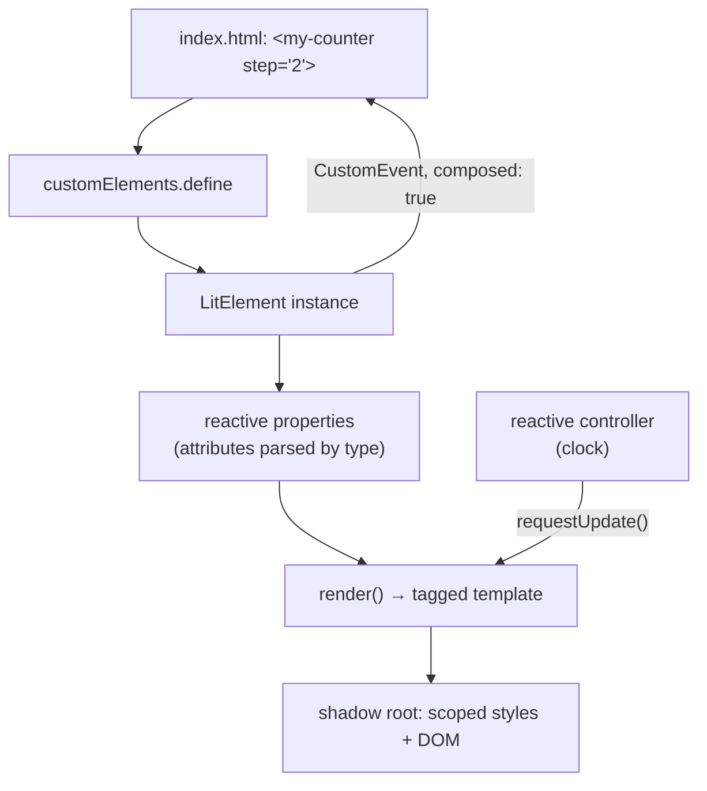

# Lit

Written against Lit 3. Lit produces standard custom elements, so the output is
usable from any page or framework — the browser is the runtime.

## What it is

Lit is a thin layer over three browser standards: custom elements (registering
a tag name against a class), shadow DOM (a subtree with its own scoped styles),
and tagged-template rendering. `LitElement` adds what the standards leave out —
declared reactive properties, batched re-rendering, and a template system that
updates only the dynamic parts of the markup.

The consequence is what makes Lit different from everything else in this
directory: the artefact is a `<my-counter>` tag, not a React or Vue component.
Anything that can parse HTML can use it — a Rails template, a React
application, a static page, another Lit element. Lit is not competing to be an
application framework; it is competing to be the layer where components are
defined so that the application framework above them can change.

Against the neighbours: `stimulus` also enhances markup but renders nothing and
has no component boundary; `preact` gives a smaller React, but only for React
consumers; Lit gives a component the browser itself understands.

## Characteristics

- **What it is good at.** Producing components with a stable, standards-based
  interface — attributes and properties in, events out — that outlive the
  framework choices around them.
- **What it is not good at.** Being an application. There is no router, no
  data layer, no server rendering in the core (server-side rendering exists as
  a separate Lit Labs package), and no state management beyond what an element
  holds.
- **Runtime behaviour.** Templates are tagged literals parsed once and cached;
  updates rewrite only the interpolated parts. The runtime is small — the
  project's own figure is roughly 5 kB minified and compressed — and there is
  no compiler in the pipeline.
- **Development experience.** The decorator syntax in the Lit documentation
  needs a build step; the static class field form used in this directory does
  not, which is why these files run from a plain HTTP server. Shadow DOM is the
  part that surprises people: page-level CSS does not reach inside an element,
  and theming goes through CSS custom properties instead.
- **Ecosystem.** Small and standards-shaped. There is no large component
  market, but Lit elements can be consumed by every framework, and several
  published design systems are built this way.
- **Learning cost.** Medium. The Lit API is small; the surrounding platform
  concepts — shadow DOM, slots, event retargeting and `composed: true`, form
  participation through `ElementInternals` — are the real material.
- **Operations.** Static files, no build required. Elements can be versioned
  and shipped independently of the applications that consume them.

## Files

- `index.html` — loads the three elements through an import map; runs as is.
- `counter-element.js` — reactive properties, `static styles`, a custom event.
- `todo-list.js` — `@state` for internal state, list rendering with `repeat`.
- `clock-element.js` — a reactive controller: reusable behaviour with its own
  hooks into the host element's lifecycle.

## Running

Serve the directory (module imports do not work over `file://` with import
maps in every browser):

    python3 -m http.server 8000
    # then open http://localhost:8000/index.html

The samples use plain JavaScript with static class fields instead of the
decorator syntax from the Lit docs, so no compiler is needed. A production
build would bundle the modules and drop the import map, but nothing about the
source changes.

## What the samples demonstrate

The four files together show an element's full contract: how state gets in, how
it renders, how it gets out, and how behaviour is shared between elements.

- `index.html` demonstrates consumption, which is the point of the whole
  directory. The elements are used as tags with attributes (`step="2"`,
  `heading="Today"`), and the page listens for `count-changed` with
  `addEventListener` — no framework, no bindings, the same code any other page
  would write. The import map is what lets the modules say `import { html } from
  "lit"` without a bundler.
- `counter-element.js` demonstrates the reactive property system: entries in
  `static properties` are read from attributes and trigger a re-render when
  assigned. `static styles` is parsed once and shared by every instance, scoped
  by the shadow root. The custom event is dispatched with `composed: true`,
  which is what allows it to cross the shadow boundary and reach the page —
  omit it and the listener in `index.html` never fires.
- `todo-list.js` demonstrates internal state (`state: true`, not reflected to
  an attribute) and the `repeat` directive with a key function, which moves DOM
  nodes instead of rebuilding them. The comment on `this._todos = [...]` records
  the rule that catches everyone: Lit compares by identity, so `push()` does
  not trigger a render.
- `clock-element.js` demonstrates reactive controllers — an object with
  `hostConnected` / `hostDisconnected` hooks that the element calls, owning its
  own timer and its own `requestUpdate()`. This is Lit's answer to what React
  does with custom hooks and Vue with composables, and it is the mechanism for
  sharing behaviour between unrelated elements.

Deliberately absent: routing, cross-element state, forms integration, and
server rendering. A design system built this way adds theming through CSS
custom properties, `ElementInternals` for form-associated controls, and a
documentation site; an application built on it adds a router and a store from
outside Lit.

## How the pieces connect

Everything crosses the element boundary as either an attribute/property going
in or an event coming out. That is the whole integration story, and it is why a
Lit element can be dropped into any of the other directories here.

## Use cases

- **Design systems consumed by more than one framework.** The strongest case:
  one implementation, usable from React, Vue, Rails templates, or plain HTML.
- **Long-lived components.** Elements written against browser standards age
  with the browser rather than with a framework's major versions.
- **Widgets embedded in third-party pages.** Shadow DOM isolates the styles in
  both directions.
- **Whole single-page applications.** Possible with a router, but nothing in
  Lit helps with data loading, and the other directories here do it better.
- **Content-heavy pages needing SEO.** Poor fit without server rendering; use
  [`astro`](../astro/), which can also render Lit components.

## Strengths and weaknesses

| | |
| --- | --- |
| Strengths | Output is a browser standard, not a framework artefact; small runtime, no compiler needed; style isolation by construction; controllers give reusable stateful behaviour |
| Weaknesses | No routing, state, or data story; shadow DOM complicates global styling, theming, and form participation; server rendering is a separate, less mature package; small ecosystem |
| Suits | Component libraries, design systems, embeds, teams that must serve several front-end stacks |
| Does not suit | Full applications wanting batteries included, content sites needing SSR, teams unwilling to learn shadow DOM's rules |

## History and adoption

- Lit is the current form of Google's web-components work, which began with
  Polymer in 2013. `lit-html` and `LitElement` (2017–2019) replaced Polymer's
  approach with tagged templates and a small base class.
- Lit 2 (2021-09) unified those packages under the `lit` name; Lit 3
  (2023-10) modernised the build targets. `lit@3.3.3` was the `latest` tag on
  npm on 2026-08-13.
- Maintained by Google, which uses web components across its own products, and
  the API surface has been stable across the 2.x and 3.x lines — an unusually
  quiet history for anything in this directory.
- Adoption is easiest to observe indirectly: Lit shows up in published design
  systems and in components shipped by organisations that must support multiple
  front-end frameworks at once, rather than in application-framework surveys.

## References

- [lit.dev](https://lit.dev/) — documentation and tutorials
- [Reactive controllers](https://lit.dev/docs/composition/controllers/)
- [lit/lit](https://github.com/lit/lit) — source and changelog
