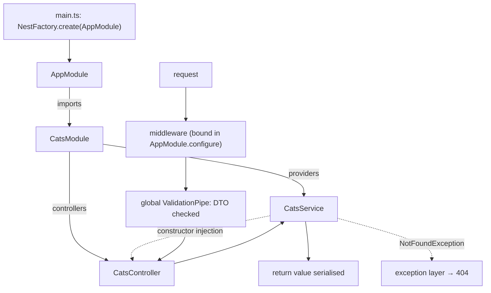

# NestJS

Written against Nest 11. Angular's architecture applied to the server:
decorators, modules, and constructor injection over Express (or Fastify, by
swapping the adapter).

## What it is

Nest is not an HTTP library. Underneath it is Express by default, or Fastify if
the adapter is swapped, and Nest's contribution is everything above that: a
module system, a dependency injection container, and a request pipeline made of
named, replaceable stages — guards, interceptors, pipes, filters.

The argument for it is the one Angular makes on the client. In a codebase large
enough that no one reads all of it, the important properties are that
boundaries are explicit (a module states what it provides and what it exports),
that dependencies are declared rather than imported ad hoc (so a service can be
replaced in a test without touching the code under test), and that every
feature is laid out the same way. Nest enforces all three.

The cost is ceremony. The five files in this directory produce four endpoints;
in [`express`](../express/) or [`hono`](../hono/) that is one file. The
investment only pays back at a size these samples cannot show, which is
precisely why the samples are worth reading as a description of the structure
rather than as an amount of code.

## Characteristics

- **What it is good at.** Consistency across a large codebase and across
  teams. It also covers far more than HTTP: microservice transports
  (Redis, NATS, gRPC, Kafka), GraphQL, WebSockets, scheduling, and queues are
  all first-party modules following the same conventions.
- **What it is not good at.** Small services. Also, the abstraction is real:
  when something goes wrong at the HTTP level, the underlying Express or
  Fastify behaviour is one layer further away than in those frameworks
  directly.
- **Runtime behaviour.** Requests pass through middleware, guards,
  interceptors, and pipes before reaching the controller, and through
  interceptors and exception filters on the way out. Providers are singletons
  within their module's injector unless a different scope is requested.
- **Development experience.** TypeScript is mandatory, decorator metadata
  drives injection (so `emitDecoratorMetadata` and `reflect-metadata` are part
  of the setup), and the CLI generates modules, controllers, and services in the
  standard shape. Testing utilities for building an injector with substituted
  providers are first-party.
- **Ecosystem.** Large and mostly first-party, with `@nestjs/*` packages for
  configuration, TypeORM/Prisma/Mongoose integration, authentication,
  scheduling, and OpenAPI generation.
- **Learning cost.** High. Modules, providers, injection scopes, and the
  pipeline stages are all new vocabulary, even for developers comfortable with
  Node.
- **Operations.** A compiled Node process. The build is `nest build`
  (TypeScript), and `app.enableShutdownHooks()` wires lifecycle events to
  process signals, which containers rely on.

## Files

- `main.ts` — bootstrap, global pipes, graceful shutdown.
- `app.module.ts` — the root module composing the feature module.
- `cats/cats.module.ts` — what the module provides and what it exports.
- `cats/dto/create-cat.dto.ts` — a DTO with `class-validator` decorators; the
  global `ValidationPipe` enforces them.
- `cats/cats.service.ts` — an injectable holding the logic.
- `cats/cats.controller.ts` — routing decorators, and nothing else.

## Running

    npm install -g @nestjs/cli
    nest new nest-demo
    cd nest-demo
    npm install class-validator class-transformer
    cp -r ../main.ts ../app.module.ts ../cats src/
    npm run start:dev

    curl localhost:3000/cats

`npm run build` compiles to `dist/` and `npm run start:prod` runs
`node dist/main`. The scaffold's own `app.controller.ts` and `app.service.ts`
are replaced by the files copied in.

## What the samples demonstrate

The six files are one feature module and the bootstrap around it — the smallest
complete example of how Nest wants an application laid out.

- `main.ts` demonstrates the composition root. `NestFactory.create(AppModule)`
  builds the injector from the module graph, and the global `ValidationPipe` is
  configured once with the three options that matter: `whitelist` drops
  properties with no decorator, `forbidNonWhitelisted` rejects them outright
  instead, and `transform` instantiates the DTO class and coerces parameter
  types. `enableShutdownHooks()` connects lifecycle hooks to process signals.
- `app.module.ts` demonstrates composition and middleware binding. `imports` is
  where feature modules are attached; the `configure(consumer)` method is where
  middleware is bound to routes, which in Nest is a module concern rather than a
  decorator on a controller.
- `cats/cats.module.ts` demonstrates the boundary. `providers` are singletons
  inside this module's injector, and only what appears in `exports` can be
  injected by a module that imports it — everything else is private. This is the
  encapsulation that [`fastify`](../fastify/) achieves with plugin scopes and
  that [`express`](../express/) does not have at all.
- `cats/dto/create-cat.dto.ts` demonstrates why DTOs are classes rather than
  interfaces: the decorators need something that survives compilation, and the
  `ValidationPipe` instantiates it at runtime.
- `cats/cats.service.ts` demonstrates the injectable: the logic, with no HTTP
  in sight. `NotFoundException` maps to a 404 without touching a response
  object, which is what lets the same service be reused from a GraphQL resolver
  or a message handler.
- `cats/cats.controller.ts` demonstrates the controller as routing and nothing
  else. Constructor injection takes the type as the token, `@Param('id',
  ParseIntPipe)` converts and rejects before the handler runs, and `@HttpCode(204)`
  sets the status for a method that returns nothing.

Deliberately absent: a database, authentication guards, interceptors, exception
filters, configuration, and tests — the last being the odd omission, since
testability is Nest's main argument. A real application adds `@nestjs/config`,
a persistence module, guards for authorisation, and `Test.createTestingModule`
suites that substitute providers.

## How the pieces connect

Two graphs overlap here: the module graph, built once at startup, and the
request pipeline, walked per request. Most Nest questions are really about
which of the two something belongs to.

## Use cases

- **Large server codebases with several teams.** Module boundaries and
  injection make ownership and substitution explicit.
- **Applications that are more than HTTP.** One codebase serving REST,
  GraphQL, queues, and scheduled jobs with the same providers.
- **Organisations already using Angular.** The concepts transfer directly.
- **Small services and functions.** Overweight; [`hono`](../hono/) or
  [`fastify`](../fastify/) are the right size.
- **Edge runtimes.** Nest expects a Node process and a compilation step.

## Strengths and weaknesses

| | |
| --- | --- |
| Strengths | Enforced structure that survives team growth; dependency injection makes testing and substitution routine; consistent conventions across REST, GraphQL, and microservices; large first-party module set; adapter choice between Express and Fastify |
| Weaknesses | Substantial boilerplate for small services; decorator metadata adds build configuration and runtime cost; the abstraction hides the underlying HTTP framework; steep learning curve; upgrades touch many `@nestjs/*` packages at once |
| Suits | Medium to very large Node applications, teams that want one prescribed architecture, long-lived services |
| Does not suit | Prototypes, single-purpose endpoints, edge or serverless functions with cold-start budgets |

## History and adoption

- Created by Kamil Myśliwiec; the first `@nestjs/core` publish on npm was in
  May 2017, with the framework's shape — modules, controllers, providers —
  established by v4 later that year.
- Nest 11 (2025-01) is the current line, and `@nestjs/core@11.1.29` was the
  `latest` tag on npm on 2026-08-13.
- The project is maintained by its author and a core team, funded through
  sponsorship and enterprise support. It is MIT licensed and publishes its own
  release notes and migration guides.
- Adoption is concentrated in server-side TypeScript work at companies that
  want a prescribed architecture — the same constituency as Angular on the
  client, which is unsurprising given the design.

## References

- [docs.nestjs.com](https://docs.nestjs.com/) — documentation
- [Modules](https://docs.nestjs.com/modules) and [providers](https://docs.nestjs.com/providers)
- [Validation with pipes](https://docs.nestjs.com/techniques/validation)
- [nestjs/nest](https://github.com/nestjs/nest) — source and changelog
