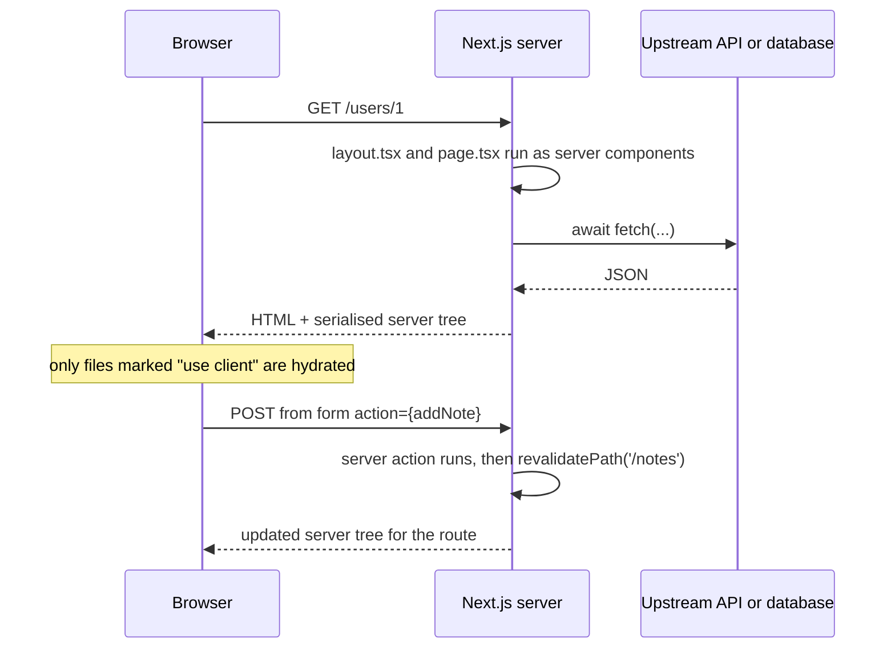

# Next.js

Written against Next.js 16, App Router. Everything under `app/` is a server
component unless the file opts out with `"use client"`, so data fetching is a
plain `await` in the component and no client bundle is shipped for it.

## What it is

Next.js is React plus the parts React deliberately leaves out: routing, server
rendering, data loading, bundling, caching, and a deployment target. It is the
most complete answer in this directory to "I have React components, now what?"

The App Router, which these samples use, is built on React Server Components.
The distinction it introduces is not client versus server *rendering* but
client versus server *components*: a server component runs only on the server,
can `await` a database or an API directly, and ships no JavaScript for itself;
a client component is bundled for the browser and can hold state and handle
events. `"use client"` marks the boundary, and the framework's job is to
stitch the two trees together — server-rendered HTML for the first paint, plus
a serialised description of the server tree so client navigations do not need a
full page load.

Server actions extend the same idea to writes: a function annotated
`"use server"` becomes an endpoint, and a `<form action={fn}>` posts to it. The
form works before hydration, because it is a real form.

Against the neighbours: [`reactrouter`](../reactrouter/) covers the same
territory with loaders and actions instead of server components, and is the
simpler model; [`nuxt`](../nuxt/) and [`sveltekit`](../sveltekit/) are the
equivalents for Vue and Svelte; [`astro`](../astro/) starts from static HTML
rather than from an application.

## Characteristics

- **What it is good at.** Covering everything a production web application
  needs — routing, rendering, metadata, images, fonts, caching, streaming —
  from one dependency with one deployment story.
- **What it is not good at.** Staying out of the way. The caching model in
  particular is a subject of its own: what is cached, for how long, and how it
  is invalidated (`revalidatePath` in `app/notes/actions.ts`) is behaviour that
  cannot be inferred from reading the component.
- **Runtime behaviour.** Pages can be static, revalidated on a timer, dynamic
  per request, or streamed in parts. The default is aggressive — `app/page.tsx`
  here fetches with `next: { revalidate: 60 }`, meaning the render is reused for
  a minute — and knowing which mode a route ended up in is a routine debugging
  question.
- **Development experience.** The best-resourced in the ecosystem: file-based
  routes, a dev server with Fast Refresh, first-party image and font handling,
  and enormous amounts of published material. The cost is that a large part of
  that material describes the Pages Router, which is a different framework in
  the same package.
- **Ecosystem.** The largest of any framework here, and the default assumption
  of most React component libraries and hosted services.
- **Learning cost.** High, and higher than plain React: server components,
  the client boundary, server actions, caching, and route conventions are all
  new material on top of React itself.
- **Operations.** `next build` then `next start` runs anywhere Node runs, in a
  container or on a VM. Some capabilities are shaped by Vercel's platform, and
  reproducing them elsewhere (incremental static regeneration, image
  optimisation, edge middleware) is the usual self-hosting work.

## Files

- `app/layout.tsx` — the required root layout: it renders `<html>` and wraps
  every page.
- `app/page.tsx` — a server component awaiting `fetch` directly, with cache
  and revalidation options.
- `app/users/[id]/page.tsx` — dynamic segment. `params` is a Promise now, so
  it has to be awaited.
- `app/counter/page.tsx` — `"use client"`: state and event handlers need it.
- `app/api/hello/route.ts` — a route handler (GET and POST) built on the web
  `Request` / `Response` objects.
- `app/notes/actions.ts` + `app/notes/page.tsx` — a server action posted from
  a form, with `revalidatePath` to refresh the cached render.

## Running

    npx create-next-app@latest next-demo --ts --app
    cd next-demo
    cp -r ../app/* app/
    npm run dev

`npm run build` produces the production output and `npm start` serves it with a
Node server. Static routes are emitted as files during the build; dynamic ones
run per request, which is why this is the first directory here whose output is
not simply a folder of assets.

## What the samples demonstrate

Six files chosen so that every boundary the App Router introduces appears
exactly once.

- `app/layout.tsx` is the required root layout — the only component that
  renders `<html>` and `<body>`. It does not re-render on navigation, which is
  what makes it the place for shell chrome, and it shows static `metadata`
  export as the declarative alternative to writing `<head>` tags.
- `app/page.tsx` is the case that justifies server components: `await fetch(...)`
  in the component body, no `useEffect`, no loading state, and none of the
  fetching code in the browser bundle. The `next: { revalidate: 60 }` option is
  where the caching model becomes visible.
- `app/users/[id]/page.tsx` shows the dynamic segment and the Next 15 change
  that surprises people returning to the framework: `params` is a Promise and
  has to be awaited. It also shows `generateMetadata` for per-page titles and
  `notFound()`, which throws and is caught by the framework rather than
  returned.
- `app/counter/page.tsx` exists to mark the other side of the boundary.
  `useState` and `onClick` require the client runtime, so the file opts in with
  `"use client"` — and the comment records the rule that keeps bundles small:
  put the directive at the leaves, not at the root.
- `app/api/hello/route.ts` shows that Next also serves plain HTTP. One file
  exports one function per method, built on the standard `Request`/`Response`,
  which is the same API the [`hono`](../hono/) and [`sveltekit`](../sveltekit/)
  samples use.
- `app/notes/actions.ts` with `app/notes/page.tsx` shows mutations without an
  API route or a client component. `"use server"` turns each export into an
  endpoint, the page passes the function itself to `<form action={...}>`, and
  `revalidatePath('/notes')` drops the cached render so the next visit shows
  the new row. The validation comment matters: a server action is a public
  endpoint, so the check belongs there and not in the browser.

Deliberately absent: a database (module-level arrays stand in and reset on
restart), authentication, `loading.tsx` and `error.tsx` boundaries, streaming
with `<Suspense>`, and tests. A real application adds a data layer, session
handling in middleware, those boundary files, and a deployment configuration.

## How the pieces connect

The build/runtime split matters as much as the client/server one: routes
without dynamic data are rendered during `next build` and served as files,
while anything reading a request runs per request.

## Use cases

- **Product applications with both public pages and an authenticated area.**
  Static marketing routes and dynamic dashboards coexist in one project.
- **Commerce and content sites at scale.** Per-route revalidation is the
  feature that makes large catalogues cacheable without going fully static.
- **Teams already on React.** The components transfer; the framework knowledge
  is the new part.
- **Small JSON APIs with no UI.** Overkill; [`hono`](../hono/) or
  [`fastify`](../fastify/) are the right size.
- **Static documentation sites.** [`astro`](../astro/) ships less JavaScript
  for the same result.

## Strengths and weaknesses

| | |
| --- | --- |
| Strengths | The most complete React stack in one dependency; server components remove a whole class of client-side data fetching; server actions cover mutations without an API layer; unmatched ecosystem and documentation |
| Weaknesses | Caching is powerful and hard to reason about; two routers (Pages and App) split the available material; upgrades across majors are substantial; the most capable path is shaped by one vendor's platform; heavier than the problem in small projects |
| Suits | Medium to large applications, content plus application in one codebase, teams that want defaults rather than choices |
| Does not suit | Pure APIs, small static sites, teams that need to control every layer of the stack |

## History and adoption

- First released by Vercel (then ZEIT) in October 2016, originally as
  server-rendered React with file-based routing.
- The App Router arrived in Next 13 (2022-10) and became the recommended path
  in 13.4 (2023). Next 15 (2024-10) made request APIs asynchronous — the
  `await params` in this directory — and Next 16 (2025-10) made Turbopack the
  default bundler and introduced the Cache Components model; see the
  [Next.js 16 release notes](https://nextjs.org/blog/next-16).
  `next@16.3.0` was the `latest` tag on npm on 2026-08-13.
- Developed by Vercel, whose hosting platform is built around it. The framework
  is MIT licensed and self-hostable with `next start`.
- On adoption: the [2025 Stack Overflow Developer Survey](https://survey.stackoverflow.co/2025/technology)
  reports Next.js used by 21.5% of responding developers, the highest of any
  meta-framework in that survey.

## References

- [nextjs.org/docs](https://nextjs.org/docs) — App Router documentation
- [Server components and `"use client"`](https://nextjs.org/docs/app/getting-started/server-and-client-components)
- [Caching and revalidating](https://nextjs.org/docs/app/guides/caching)
- [vercel/next.js](https://github.com/vercel/next.js) — source and changelog
