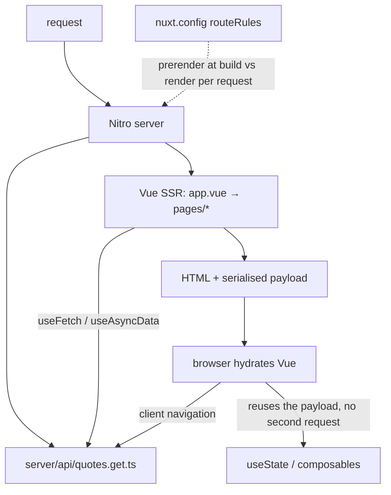

# Nuxt

Written against Nuxt 4. Two conventions do most of the work: files under
`app/pages/` become routes, and everything in `app/composables/` and
`app/components/` is auto-imported — no import statements for them anywhere.

Nuxt 4 moved the app source under `app/`; `server/` stays at the project root.

## What it is

Nuxt is to Vue what Next.js is to React: routing, server rendering, data
loading, build tooling, and a server runtime assembled into one framework with
conventions instead of configuration. `nuxt.config.ts` in this directory is
almost empty, and that is representative — most of a Nuxt application's
structure comes from where its files are.

The part that has no direct equivalent in the other meta-frameworks here is
Nitro, the server engine underneath. Nitro is a standalone project: it builds
the server half of the application into a portable bundle and has adapters for
Node, Deno, Cloudflare Workers, Vercel, Netlify, and others. That is why
`server/api/quotes.get.ts` is not tied to any host, and it is the main reason
to reach for Nuxt over a Vue SPA plus a separate API.

The second distinguishing idea is per-route rendering. `routeRules` in
`nuxt.config.ts` sets the strategy for each URL pattern independently —
prerendered here, server-rendered there — so one project can be a static site
and an application at the same time.

## Characteristics

- **What it is good at.** Removing boilerplate. Auto-imports, file routes,
  payload transfer between server and client, and typed `server/api` handlers
  mean a feature is usually one or two files with no wiring.
- **What it is not good at.** Making provenance obvious. A composable used
  with no import statement is convenient and untraceable by grep; the generated
  `.nuxt/` types are what tell an editor where it came from.
- **Runtime behaviour.** Server rendering by default, with the fetched payload
  serialised into the HTML so the browser does not repeat the request during
  hydration. `useState` exists because a module-level `ref` on the server would
  be shared between users' requests — a genuine SSR hazard the framework fixes
  by construction.
- **Development experience.** Vite-based dev server, Nuxt DevTools in the
  browser, and `nuxi` for scaffolding. Hydration mismatches are the
  characteristic bug class, as in every SSR framework.
- **Ecosystem.** A large first-party module registry — content, image,
  internationalisation, SEO, authentication, Pinia — installed with one line
  each. Module quality varies more than the core does.
- **Learning cost.** Medium. Vue transfers directly; what is new is the
  server/client split, the auto-import conventions, and which composable to use
  (`useFetch`, `useAsyncData`, `useState`, `$fetch`) in which situation.
- **Operations.** `nuxt build` produces a Nitro server bundle; `nuxt generate`
  produces a static site. The deployment target is a build-time choice rather
  than a rewrite, which is unusual among the frameworks here.

## Files

- `nuxt.config.ts` — the whole configuration surface, mostly empty on purpose.
- `app/app.vue` — the shell, with `<NuxtPage>` as the router outlet.
- `app/pages/index.vue` — `useFetch`, which runs on the server during SSR and
  passes the payload to the client instead of fetching twice.
- `app/pages/users/[id].vue` — dynamic route with `useAsyncData` keyed on the
  route param.
- `server/api/quotes.get.ts` — a Nitro API route; the `.get` suffix is the
  HTTP method.
- `app/composables/useCounter.ts` — an auto-imported composable.

## Running

    npx nuxi@latest init nuxt-demo
    cd nuxt-demo
    cp -r ../app ../server ../nuxt.config.ts .
    npm run dev

`npm run build` emits a Nitro server bundle under `.output/`, started with
`node .output/server/index.mjs`. `npm run generate` prerenders every route to
static files instead. Both come from the same source.

## What the samples demonstrate

The six files are one small application that crosses the client/server boundary
three different ways.

- `nuxt.config.ts` demonstrates the configuration surface worth knowing:
  `runtimeConfig` splits values into server-only and `public` (browser-visible,
  overridable by `NUXT_*` environment variables), and `routeRules` sets
  rendering per route — `/` prerendered at build time, `/users/**` rendered per
  request. Prerendering `/` means Nitro runs the app *and* `/api/quotes` during
  the build.
- `app/app.vue` demonstrates the shell: `<NuxtPage>` is the router outlet
  without which no page renders, `<NuxtLink>` prefetches the payload of a route
  when it scrolls into view, and `useHead` is auto-imported like every other
  Nuxt composable.
- `app/pages/index.vue` demonstrates the payload mechanism, which is the
  central SSR idea. `useFetch` runs on the server during the initial render and
  serialises its result into the HTML; the browser reuses it rather than issuing
  the same request again. The explicit `key` is what lets the client find the
  server's result.
- `app/pages/users/[id].vue` demonstrates the general form. `useAsyncData`
  wraps any async function — `useFetch` is the `$fetch` shorthand — and
  `watch: [() => route.params.id]` re-runs it when the parameter changes, so
  navigating between `/users/1` and `/users/2` refetches without a full page
  load. `createError({ statusCode: 404, fatal: true })` sets the real HTTP
  status during SSR instead of rendering an empty page with a 200.
- `server/api/quotes.get.ts` demonstrates the Nitro half. The `.get` suffix in
  the file name is the HTTP method, `defineEventHandler` returns plain values
  that are serialised as JSON, and this code is bundled separately from the
  client — which is where secrets can safely live.
- `app/composables/useCounter.ts` demonstrates auto-imports and `useState`,
  Nuxt's SSR-safe replacement for a module-level `ref`.

Deliberately absent: a database, authentication, Pinia, middleware, and error
pages. A real application adds a data layer behind `server/api`, route
middleware for auth, `error.vue`, and probably several first-party modules.

## How the pieces connect

## Use cases

- **Vue applications that need SEO or fast first paint.** The default case.
- **Sites that are part static, part dynamic.** `routeRules` is designed for
  exactly this, and avoids splitting the project in two.
- **Deployments that must stay portable.** Nitro's adapters make the hosting
  choice reversible, which is a real difference from the alternatives.
- **Pure JSON APIs.** Nitro alone can do it, but [`hono`](../hono/) or
  [`fastify`](../fastify/) are the honest choice.
- **React shops.** Nothing transfers; the equivalent is
  [`nextjs`](../nextjs/) or [`reactrouter`](../reactrouter/).

## Strengths and weaknesses

| | |
| --- | --- |
| Strengths | Conventions remove most wiring; Nitro makes the deployment target a build option; per-route rendering strategies in one project; large first-party module registry; payload transfer avoids double fetching |
| Weaknesses | Auto-imports obscure where things come from; two directory layouts in circulation since Nuxt 4; module quality is uneven; SSR adds hydration bugs and a server to operate; smaller total ecosystem than React's |
| Suits | Vue teams building content-heavy or SEO-sensitive applications, projects that mix marketing pages and app screens |
| Does not suit | Teams standardised on React, API-only services, projects that must avoid a server entirely (use `nuxt generate` or a plain Vue SPA) |

## History and adoption

- Created in October 2016 by Alexandre and Sébastien Chopin as a Vue equivalent
  of Next.js. Nuxt 2 (2018) is the long-lived legacy line.
- Nuxt 3 (2022-11) was a rewrite on Vue 3, Vite, and Nitro. Nuxt 4
  (2025-07-15) is a stability release whose most visible change is the `app/`
  directory used here; see [Announcing Nuxt 4.0](https://nuxt.com/blog/v4).
  `nuxt@4.5.2` was the `latest` tag on npm on 2026-08-13.
- In July 2025 Vercel acquired NuxtLabs, the company funding the core team;
  Vercel's [announcement](https://vercel.com/blog/nuxtlabs-joins-vercel) states
  that Nuxt and Nitro keep their MIT licence, public roadmap, and open
  governance. Nitro continues to serve other frameworks and hosts.
- Adoption tracks Vue's: the framework is the default full-stack choice inside
  the Vue ecosystem, and Nitro is used beyond it as a server layer.

## References

- [nuxt.com/docs](https://nuxt.com/docs) — documentation
- [Rendering modes and `routeRules`](https://nuxt.com/docs/guide/concepts/rendering)
- [Nitro](https://nitro.build/) — the server engine and its deployment presets
- [nuxt/nuxt](https://github.com/nuxt/nuxt) — source and changelog
