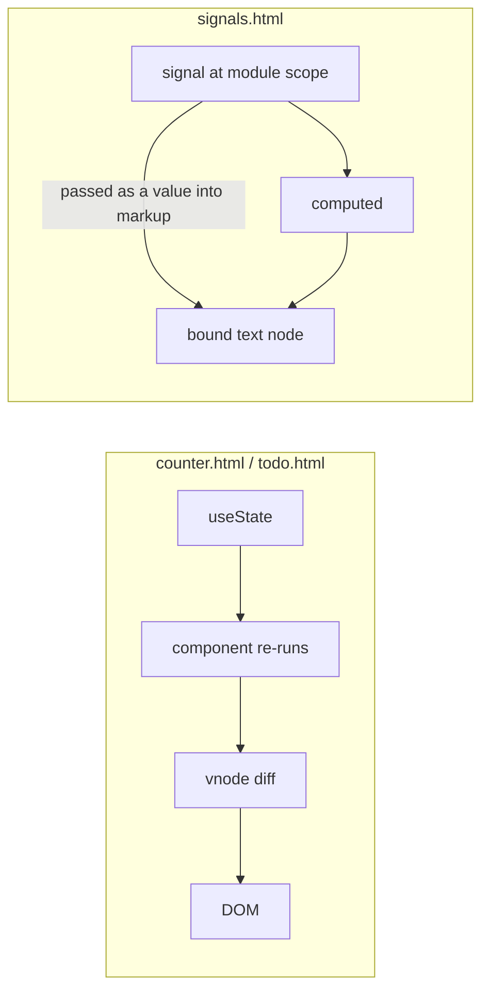

# Preact

Written against Preact 10. Same API surface as React in ~3 kB, and with `htm`
it needs no compiler at all — every file here opens straight in a browser.

## What it is

Preact is a reimplementation of React's component and hook API in a fraction of
the code. Components, props, hooks, context, and the virtual DOM all work the
way React's do; what is missing is the parts of React that carry weight — the
synthetic event system (Preact uses real DOM events), the scheduler, and the
newer server-component machinery.

Two things make it more than "React, smaller". The first is `preact/compat`, an
alias layer that lets a bundler point `react` and `react-dom` at Preact so
existing React libraries keep working. The second is `@preact/signals`, an
independent reactive primitive: state that lives outside the component tree and
updates the DOM node that read it without re-rendering the component at all.
`signals.html` here demonstrates exactly that.

Preact's niche is where the bundle is the budget: a widget on someone else's
page, an embedded panel, an island inside a mostly static site. The
[`astro`](../astro/) directory in this repository uses Preact for precisely
that reason.

## Characteristics

- **What it is good at.** Shipping little. The library is small enough that the
  decision to use a component framework at all stops being a performance
  question for small interactive pieces.
- **What it is not good at.** Being React in the corners. Anything depending on
  React internals, `react-dom/server` behaviour, or React 19 server components
  is outside what `preact/compat` covers.
- **Runtime behaviour.** A virtual DOM with the same reconciliation model as
  React, so re-render management (keys, `useMemo`, component boundaries) is the
  same discipline. Signals are the escape hatch when a value changes often.
- **Development experience.** Identical to React's for day-to-day work, and
  better in one respect: with `htm` there is no build step, so a page is a
  file. The trade is that `htm` is a tagged template, so editors give it less
  help than JSX.
- **Ecosystem.** Its own is small; through `preact/compat` it borrows React's,
  imperfectly. Preact ships its own router and a CLI, both modest.
- **Learning cost.** Effectively zero for a React developer. For everyone else
  it is the same learning curve as React, minus the meta-framework layer.
- **Operations.** Static files. No server, no SSR unless `preact-render-to-string`
  or a host framework such as Astro provides one.

## Files

- `counter.html` — `htm` tagged templates instead of JSX, plus `useState`.
- `todo.html` — hooks (`useState`, `useMemo`, `useCallback`) over a list.
- `signals.html` — `@preact/signals`: state outside the component tree, where
  reading `.value` in the markup updates only that text node, not the component.

## Running

Open any of them in a browser. For a project with JSX instead:

    npm create vite@latest preact-demo -- --template preact

That project builds to static assets with `npm run build`. Nothing here needs a
server: all three pages import Preact, its hooks, and `htm` from a CDN.

## What the samples demonstrate

- `counter.html` demonstrates the no-build path. `htm.bind(h)` produces a tag
  function whose templates evaluate to the same vnodes JSX would compile to, so
  the file is a working component page with no toolchain. This is the property
  that separates Preact from React in practice, not the byte count.
- `todo.html` demonstrates that the React hook vocabulary is intact:
  `useState` for the list and the draft, `useMemo` for the filtered view
  recomputed only when its inputs change, `useCallback` for a stable handler
  identity. The filter buttons exist to give `useMemo` something to depend on.
- `signals.html` demonstrates the other model. `signal(0)` lives at module
  scope — no provider, no prop drilling — and passing the signal itself into
  the markup, rather than `count.value`, lets Preact bind the text node
  directly. The `console.log` in `Display` proves the component never re-runs
  while the number on screen keeps changing. `Buttons` mutates the same signal
  from a different part of the tree.

Deliberately absent: routing, a build, and any server rendering. Growing this
into an application means either adopting `preact-iso` for routing and
hydration, or embedding these components as islands in a host framework such as
Astro — the more common shape in practice.

## How the pieces connect

Both models are Preact; the second bypasses the component entirely for values
that change often. `htm` sits in front of both, turning template literals into
the vnodes that the diff consumes.

## Use cases

- **Widgets on pages you do not own.** Analytics panels, embedded forms,
  third-party components: the size argument is decisive.
- **Islands inside a static site.** See `astro/src/components/Counter.jsx`,
  which is a Preact component rendered by Astro and hydrated on demand.
- **Replacing React in an existing app to cut bundle size.** Through
  `preact/compat`, with testing, because the compatibility is close but not
  total.
- **Large applications with a deep React library stack.** Poor fit; stay on
  React rather than debug compat edge cases.
- **Anything needing React server components.** Not supported; use
  [`nextjs`](../nextjs/).

## Strengths and weaknesses

| | |
| --- | --- |
| Strengths | Very small runtime; React's API without React's size; runs with no build step through `htm`; signals for state outside the tree; drop-in alias for many React libraries |
| Weaknesses | Compat is close, not exact; no server components; small first-party ecosystem; tagged templates get weaker editor support than JSX |
| Suits | Widgets, embeds, islands, size-constrained pages, teams that already know React |
| Does not suit | Applications built on React-internal libraries or server components, projects wanting one large first-party ecosystem |

## History and adoption

- Created by Jason Miller; first published to npm in September 2015, shortly
  after React's own rise, with the explicit goal of the same API in a fraction
  of the size.
- Preact 10 (2019-10) brought hooks, fragments, and the current architecture;
  the 10.x line has been stable since. `preact@10.29.8` was the `latest` tag on
  npm on 2026-08-13, with 11.0 published under the `beta` and `rc` tags.
- `@preact/signals` (2022) introduced the signal primitive used in
  `signals.html`; the same idea now appears across the frameworks in this
  directory.
- Preact is a community project rather than a vendor's. Its most visible use
  today is as an island renderer inside static-site frameworks, which is how
  this repository uses it in [`astro`](../astro/) as well.

## References

- [preactjs.com](https://preactjs.com/) — documentation
- [Differences to React](https://preactjs.com/guide/v10/differences-to-react/)
- [Signals](https://preactjs.com/guide/v10/signals/)
- [preactjs/preact](https://github.com/preactjs/preact) — source and changelog
