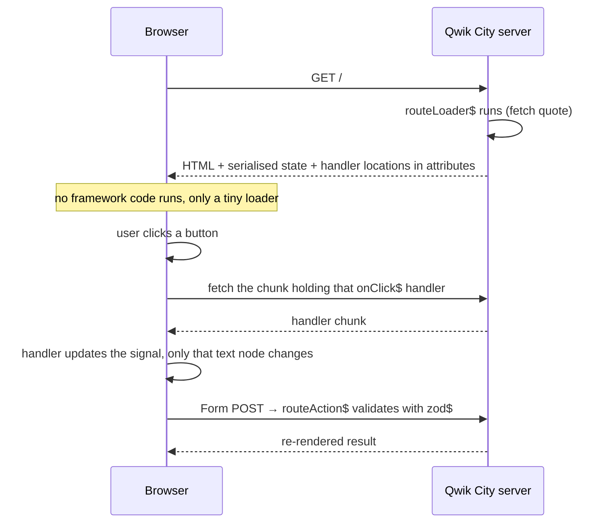

# Qwik

Written against Qwik 1.20. The selling point is resumability: the server sends
HTML with the listener locations encoded in attributes, and no JavaScript runs
on load. Clicking a button downloads just that handler — which is why every
boundary is a `$`: `component$`, `useTask$`, `onClick$`. Each `$` marks a spot
the optimiser can split into its own lazy-loaded chunk.

## What it is

Every other server-rendering framework in this directory hydrates: the browser
receives HTML, then downloads the same components, re-executes them, and
re-attaches the event listeners so the page becomes interactive. The cost of
that scales with the size of the application, and it is paid on every first
load.

Qwik removes the step. The server serialises not just the HTML but the
application's state and the location of every event handler, as attributes in
the markup. The browser loads a small loader script, and nothing else — until
the user does something, at which point exactly the chunk containing that
handler is fetched and run. Startup cost stops scaling with application size.

Everything else in Qwik follows from making that possible. Closures crossing a
`$` boundary must be serialisable, so no class instances, no open handles, no
captured DOM nodes. State lives in signals and stores that survive the trip
through HTML. Code that genuinely must run eagerly in the browser has to say so
through `useVisibleTask$`, whose deliberately awkward name marks it as the
escape hatch.

Qwik City is the routing and server layer on top, and is what `routes/index.tsx`
here uses.

## Characteristics

- **What it is good at.** Time to interactive on a first, cold visit,
  independent of how large the application is.
- **What it is not good at.** Anything that resists serialisation. Third-party
  client libraries that expect to be initialised at load, stateful class
  instances, and long-lived connections all fight the model.
- **Runtime behaviour.** Fine-grained reactivity through signals and stores;
  rendering updates only the subscribed parts of the DOM. Code arrives as many
  small chunks, prefetched in the background, which trades a simple bundle
  graph for many small requests.
- **Development experience.** JSX and TypeScript, familiar on the surface. The
  unfamiliar part is thinking about which side of a `$` a piece of code lives
  on, and serialisation errors are the characteristic Qwik bug.
- **Ecosystem.** The smallest of the server-rendering options here. Qwik City
  covers routing, loaders, actions, and endpoints; beyond that there is a
  React-interop layer (`qwik-react`) and comparatively few integrations.
- **Learning cost.** High, not because the API is large but because the model
  is genuinely different and the constraints are enforced at runtime.
- **Operations.** Needs a server or edge runtime that Qwik City has an adapter
  for. The build produces many chunks, so a CDN in front is assumed.

## Files

- `counter.tsx` — `useSignal`, `useComputed$`, and `useVisibleTask$` for the
  rare case that really does need to run in the browser.
- `todo.tsx` — `useStore` for object state, handlers as `$()` closures.
- `routes/index.tsx` — Qwik City: `routeLoader$` runs on the server before
  render, `routeAction$` + `<Form>` handle the POST without client code.

## Running

    npm create qwik@latest
    cd <project>
    cp -r ../counter.tsx ../todo.tsx ../routes src/
    npm start

Serialisation is the constraint to remember: anything captured by a `$` closure
has to survive a trip through HTML, so no class instances or open handles.

`npm run build` produces the client chunks and a server bundle; `npm run
preview` serves it locally. Deployment needs an adapter for the target
(Node, Cloudflare, Netlify, and others are provided).

## What the samples demonstrate

- `counter.tsx` demonstrates the resumability primitives at their smallest.
  `useSignal` is a serialisable box, so the count survives the server render and
  is picked up in the browser without the component re-running. `useComputed$`
  derives from it lazily. `useVisibleTask$` is included precisely to show the
  exception: an eager browser-side effect with a `cleanup` callback, marked
  clearly as the thing to avoid where possible.
- `todo.tsx` demonstrates state that is an object rather than a value.
  `useStore(..., { deep: true })` tracks nested mutation, so toggling
  `todo.done` inside the list updates without replacing the array. The `$()`
  wrappers around `add` and `remove` show handlers becoming their own lazy
  chunks; `preventdefault:submit` shows Qwik declaring browser behaviour in the
  markup, because there is no eagerly running JavaScript to call
  `preventDefault()` for it.
- `routes/index.tsx` demonstrates the full-stack half. `routeLoader$` runs on
  the server before render and its result is serialised into the HTML, so the
  browser issues no second request. `routeAction$` with `zod$` declares a POST
  endpoint and its validation in one place, and `<Form>` posts to it — with
  JavaScript disabled it is still a plain HTML form submission, and with
  JavaScript it becomes a fetch.

Deliberately absent: authentication, a database, streaming, and any client
library integration — which is where the serialisation constraint would first
be felt. A real application adds a data layer behind the loaders, session
handling in middleware, and an adapter for the deployment target.

## How the pieces connect

The line to notice is the one that is missing: there is no "download and
re-execute the application" step between the HTML arriving and the page being
usable.

## Use cases

- **Content-heavy pages that must also be interactive.** Commerce listings,
  publications, landing pages — where hydration cost is paid by users who may
  never interact.
- **Applications served to slow devices or networks.** The startup cost is
  roughly constant regardless of application size.
- **Sites that would otherwise be static with a few islands.**
  [`astro`](../astro/) is the simpler tool for that shape; Qwik is the answer
  when the whole page is interactive but the startup cost still matters.
- **Dashboards behind a login.** Weak fit: first-load cost matters least where
  the session is long and the audience is small.
- **Projects depending on many browser-side libraries.** Weak fit; each one has
  to be reconciled with the serialisation rules.

## Strengths and weaknesses

| | |
| --- | --- |
| Strengths | No hydration step at all; startup cost independent of application size; loaders and actions cover the full stack; JSX and TypeScript on the surface |
| Weaknesses | Serialisation constraints leak into ordinary code; smallest ecosystem of the server-rendering options here; many small chunks complicate debugging and caching; requires a supported server or edge runtime; the 2.0 line is still in beta |
| Suits | Public, content-heavy, interactive pages where first-load performance is a business metric |
| Does not suit | Internal applications, teams needing a large integration ecosystem, code that must initialise browser libraries eagerly |

## History and adoption

- Started at Builder.io by Miško Hevery, who created AngularJS, with Adam
  Bradley; the first `@builder.io/qwik` publish on npm was in June 2021 and 1.0
  arrived in May 2023.
- The project has since moved to the QwikDev organisation on GitHub. Version 2
  is published under a new package name, `@qwik.dev/core`, and was at beta on
  2026-08-13; the stable line remains `@builder.io/qwik@1.20.0`, which this
  directory targets.
- Resumability is the idea Qwik contributed to the field; it remains the only
  framework here that implements it, and adoption is correspondingly narrow
  compared with the React and Vue meta-frameworks.

## References

- [qwik.dev](https://qwik.dev/) — documentation
- [Think Qwik: resumable, not hydrated](https://qwik.dev/docs/concepts/resumable/)
- [QwikDev/qwik](https://github.com/QwikDev/qwik) — source and changelog
