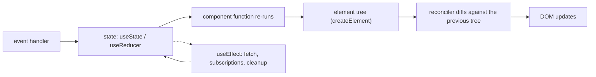

# React

Written against React 19.

## What it is

React is a library for describing what the DOM should contain as a function of
state. A component is a function returning a description of UI; when state
changes React calls the function again, compares the new description with the
previous one, and applies the smallest set of DOM operations that reconciles
them. That is the whole idea, and everything else — routing, data fetching,
forms, styling — is left to other packages.

The problem it set out to solve was the one every jQuery-era page eventually
hit: with the DOM as the source of truth, every new feature has to know how to
undo the effects of every other. React removed the question by making state the
source of truth and rendering a pure function of it.

Among the alternatives in this directory, React is the baseline the others
define themselves against. `preact` reimplements its API in a fraction of the
size, `solidjs` keeps the JSX and discards the virtual DOM, `svelte` compiles
the same idea away, and `vue` reaches the same place from templates.

## Characteristics

- **What it is good at.** Composition. Components take props and return UI, so
  a screen is assembled out of parts that can be read, moved, and tested in
  isolation. The model holds from a button up to a whole application.
- **What it is not good at.** Deciding anything for you. Two React codebases
  can share no libraries beyond React itself, and the cost of that freedom is
  paid on every new project and every new hire.
- **Runtime behaviour.** Re-rendering is by subtree, not by value: a state
  change re-runs the component and its children, and it is the developer's job
  to keep that cheap with `key`s, `useMemo`, `useCallback`, and component
  boundaries. Getting this wrong is the most common React performance problem.
- **Development experience.** Fast Refresh, a browser extension for inspecting
  the tree, and the largest volume of documentation and prior art of anything
  in this directory. Hooks have rules (call order, dependency arrays) that
  ESLint enforces because the runtime cannot.
- **Ecosystem.** The largest. Routers, data layers, component kits, form
  libraries, tables, and charts all exist several times over, which is both the
  strength and the reason two React projects can look unrelated.
- **Learning cost.** Low to render a first screen; high to be fluent. Referential
  identity, effect timing, stale closures, and the client/server component split
  in React 19 are all subjects of their own.
- **Operations.** Bare React is static files: any CDN serves them, there is no
  server to run. Server rendering means adopting a meta-framework — `nextjs` or
  `reactrouter` in this repository.

## Files

- `counter.html` — a page that runs as is: React and ReactDOM pulled from a CDN,
  `createElement` instead of JSX so no compiler is needed.
- `todo-app.jsx` — `useReducer` for list state, controlled input, keyed rendering.
- `use-fetch.jsx` — a custom hook wrapping `fetch` with `AbortController`,
  loading and error states.

## Running

`counter.html` only needs a browser (open it over `file://` or any static
server). The `.jsx` files need a build step:

    npm create vite@latest react-demo -- --template react
    cd react-demo && npm install
    cp ../todo-app.jsx src/
    # render it from src/main.jsx, then
    npm run dev

`npm run build` emits static assets into `dist/`, and `npm run preview` serves
them; production is a static host or any web server, since nothing here runs
on a server.

## What the samples demonstrate

Together the three files show the three things a React application is made of:
local state, derived rendering, and side effects with a lifecycle.

- `counter.html` exists to prove that React needs no toolchain. It imports from
  a CDN and calls `createElement` directly, which is what JSX compiles to, so
  the file shows the shape of React underneath the syntax. It also shows the
  updater form of `setState` (`setCount(c => c + step)`), which is the correct
  answer to the stale-value problem that bites every beginner.
- `todo-app.jsx` picks `useReducer` over several `useState` calls to show state
  transitions named as actions rather than scattered as assignments — the
  pattern that scales when a screen's state grows. The `key` is the item's
  stable id, and the comment says why: keying by array index reuses the wrong
  DOM node when the list changes shape.
- `use-fetch.jsx` shows that a custom hook is nothing but a function calling
  other hooks. It packages a request's whole lifecycle — start, abort on
  change, error, completion — behind `{ data, error, loading }`, which is the
  interface every data-fetching library in the React ecosystem also exposes.

What is deliberately missing: a router, a server, a state manager, and a build
config. Growing this into an application means adding a router (`react-router`,
see the [`reactrouter`](../reactrouter/) directory), a data layer that caches
and deduplicates requests, error boundaries around the fetching components, and
a meta-framework if the HTML has to exist before JavaScript runs.

## How the pieces connect

Everything is inside the browser. `use-fetch.jsx` is the only place the sample
touches a network: it calls a public JSON API directly from the component, with
no server of this project's own in between.

## Use cases

- **SPAs and application shells.** The default choice, mostly because the
  hiring pool and the library set are the largest.
- **Embedded widgets.** A React tree can be mounted into an existing page;
  `preact` is the better choice when the bundle budget is tight.
- **Design systems.** Works, though components are only usable from React —
  `lit` produces custom elements that any stack can consume.
- **Content sites.** Poor fit on its own: bare React means an empty `
`
  until JavaScript runs. Use `astro` or `nextjs` instead.
- **Anything needing SSR, routing, or data loading conventions.** Not React's
  job; pick a meta-framework.

## Strengths and weaknesses

| | |
| --- | --- |
| Strengths | One idea (UI as a function of state) applied consistently; unmatched ecosystem and documentation; portable — the same components run under Next.js, React Router, Astro islands, or plain Vite |
| Weaknesses | Performance is opt-in work (memoisation, keys, boundaries); no built-in routing, data, or forms, so every project re-decides; hooks have non-obvious rules; the client/server component split adds a second mental model |
| Suits | Teams that need to staff a project easily, applications with many interactive screens, anything that may later need SSR through a meta-framework |
| Does not suit | Pages that must be interactive before JavaScript loads, tiny widgets on a size budget, teams that want the framework to make the architectural decisions |

## History and adoption

- Developed at Facebook and open-sourced in 2013. React 0.14 (2015) split
  rendering into `react-dom`, which is why the two packages are imported
  separately in `counter.html`.
- React 16 (2017) rewrote the reconciler ("Fiber"); 16.8 (2019) added hooks and
  made function components the default way to hold state, which is the style
  every file here uses.
- React 18 (2022) introduced concurrent rendering and `createRoot`, used in
  `counter.html`. React 19 (2024-12) added actions, the `use` API, and the
  server-component model that the [`nextjs`](../nextjs/) samples build on.
- Stewarded by Meta together with outside contributors; the documentation and
  release notes are at [react.dev](https://react.dev/).
- On adoption: the [2025 Stack Overflow Developer Survey](https://survey.stackoverflow.co/2025/technology)
  reports React used by 46.9% of responding developers, the highest of any
  front-end library in that survey. `react@19.2.8` was the `latest` tag on npm
  on 2026-08-13.

## References

- [react.dev](https://react.dev/) — documentation and blog
- [React 19 release notes](https://react.dev/blog/2024/12/05/react-19)
- [facebook/react](https://github.com/facebook/react) — source and changelog
