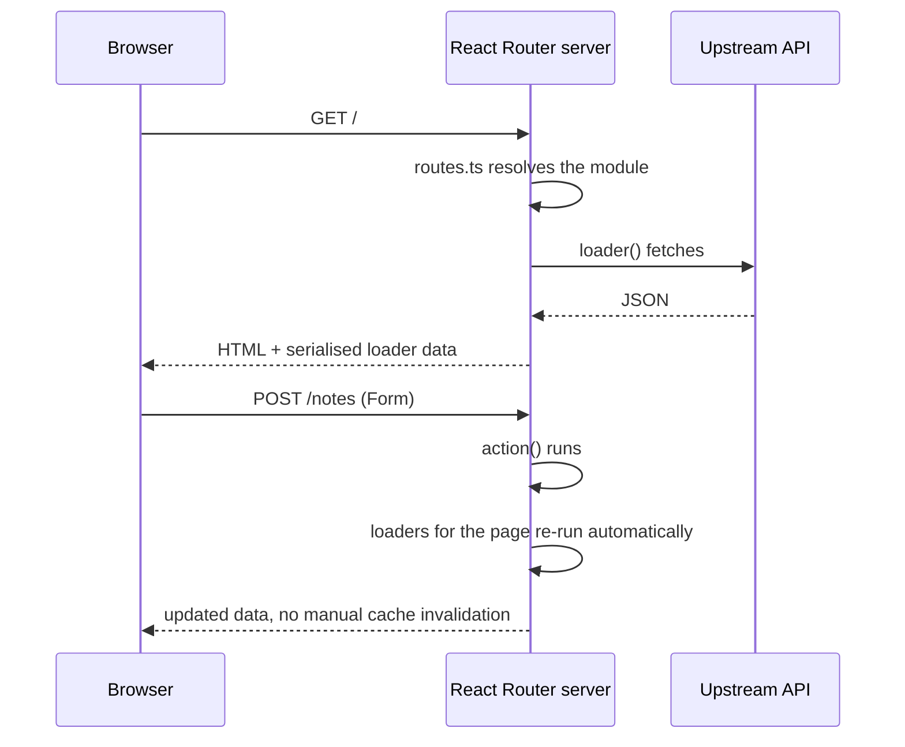

# React Router

Written against React Router 8 in framework mode — the mode that absorbed
Remix, so a route module here is a Remix route module: `loader` on the server,
`action` for writes, and the component in between.

Routes are declared in `app/routes.ts` rather than by file position, and the
types for each module are generated into `./+types/<route>`.

## What it is

React Router is two things in one package, and knowing which one is being
discussed removes most of the confusion around it:

- **The router.** The library React applications have used for a decade to map
  URLs to components. Still there, still usable on its own.
- **Framework mode.** The router plus a Vite plugin, a server, data loading,
  form handling, and code splitting — what used to be shipped as Remix, folded
  into React Router in version 7.

This directory is the second. The unit of work is a route module: a file
exporting a `loader` that runs on the server before rendering, an `action` that
handles non-GET requests, a default export that renders, and optionally `meta`
and `ErrorBoundary`. After an action completes, the loaders on the page re-run
automatically — there is no cache to invalidate and no query client to
configure.

Against [`nextjs`](../nextjs/): the same problem solved with less machinery.
There are no server components and no cache directives; the server/client
split is "loaders and actions run on the server, the component runs in both
places". That is easier to reason about and gives up the ability to keep
component code entirely off the client.

## Characteristics

- **What it is good at.** Data and mutations. Loaders, actions, automatic
  revalidation, and pending states (`useNavigation`) cover the whole cycle a
  form-driven application spends its time in.
- **What it is not good at.** Being recognised. Search results conflate three
  different things — declarative routing, data routers, and framework mode —
  and much published material predates the merge.
- **Runtime behaviour.** Server-rendered by default, with client-side
  navigation afterwards. SPA and prerendered modes exist for projects that do
  not want a server. Routes are code-split by the Vite plugin.
- **Development experience.** Route types are generated per module, so
  `loaderData` in the component is typed from what the loader actually returned
  — no manual generics, no `as` casts. Routes are declared in code, so
  finding what a URL maps to is a file read rather than a convention lookup.
- **Ecosystem.** React's, plus Remix's accumulated patterns. Fewer
  framework-specific integrations than Next.js has.
- **Learning cost.** Medium. The API is small; the work is unlearning
  `useEffect`-based data fetching in favour of loaders.
- **Operations.** Builds to a server bundle plus client assets; the Node
  server is a plain request handler, with adapters for other hosts. Nothing in
  the model requires a particular platform.

## Files

- `app/routes.ts` — the route config: `index`, `route`, `layout`, `prefix`.
- `app/routes/home.tsx` — `loader`, `meta`, and `useLoaderData` via typed props.
- `app/routes/notes.tsx` — `loader` + `action` + `<Form>`, with
  `useNavigation` for the pending state.
- `app/routes/api.time.ts` — a resource route: a loader with no component,
  which makes it a plain endpoint.

## Running

    npx create-react-router@latest rr-demo
    cd rr-demo
    cp -r ../app/* app/
    npm run dev

`npm run build` produces `build/client` and `build/server`; `npm start` runs
the built server. A `ssr: false` configuration turns the same project into a
single-page or prerendered application instead.

## What the samples demonstrate

Four files covering the three shapes a route module can take.

- `app/routes.ts` demonstrates the explicit route config: URL on the left,
  module on the right, with `index` and `route` used here and `layout` shown in
  a comment for nesting. This is the visible difference from the file-based
  conventions of [`nextjs`](../nextjs/), [`nuxt`](../nuxt/), and
  [`sveltekit`](../sveltekit/) — and `@react-router/fs-routes` exists for teams
  that prefer their approach.
- `app/routes/home.tsx` demonstrates a read-only route: a `loader` that runs on
  the server, whose return value is serialised into the HTML and handed to the
  component as a typed prop; `meta` for the document head; and an
  `ErrorBoundary` that catches whatever the loader or the component below it
  throws. Throwing a `Response` from the loader — `throw new Response('upstream
  failed', { status: 502 })` — is how a route short-circuits with a real status
  code.
- `app/routes/notes.tsx` demonstrates the write path. `<Form method="post">`
  posts like a plain form before hydration and over fetch afterwards; the
  `action` handles both the add and the delete through a hidden `intent` field;
  and after it returns, the loader re-runs on its own. `useNavigation()` gives
  the pending state that disables the button — the small detail that separates
  a form that feels finished from one that does not.
- `app/routes/api.time.ts` demonstrates a resource route: no default export, so
  nothing renders and the `Response` from the loader is returned as is. This is
  how the same project serves JSON, webhooks, RSS, or images without a separate
  server.

Deliberately absent: a database, sessions and authentication, nested layouts
(shown commented in `routes.ts`), `useFetcher` for mutations that should not
navigate, and deferred/streaming data. A real application adds session
middleware, a data layer behind the loaders, and nested routes for the shared
chrome.

## How the pieces connect

The component is the only part that runs in both places. Everything with a
secret in it — the loader, the action — runs only on the server, and the type
generator keeps the contract between them checked.

## Use cases

- **Data-driven React applications.** Dashboards, back offices, anything whose
  screens are mostly "load this, show it, submit that".
- **Applications with many forms.** Actions plus automatic revalidation remove
  the usual state-synchronisation code.
- **Existing React Router codebases.** Framework mode is reachable
  incrementally from the router that is already there.
- **Content and marketing sites.** Works, but [`astro`](../astro/) ships less
  JavaScript for the same pages.
- **Projects that want server components today.** [`nextjs`](../nextjs/) is
  further along that path.

## Strengths and weaknesses

| | |
| --- | --- |
| Strengths | Loaders and actions are a small, predictable model; automatic revalidation after mutations; per-route generated types; explicit route config; forms work before hydration; no proprietary caching layer |
| Weaknesses | Three modes under one name make documentation and search results confusing; several migrations in recent years (v5→v6→v7→v8); fewer platform integrations than Next.js; server components are not the model here |
| Suits | React teams building data- and form-heavy applications, projects that want SSR without adopting a caching framework |
| Does not suit | Teams that want file-based routing conventions without configuration, projects betting on React Server Components, static content sites |

## History and adoption

- React Router was first published in February 2014 and has been the default
  routing library for React applications through several redesigns, notably v4
  (2017) and v6 (2021).
- Remix, by the same team, was released in 2021 and acquired by Shopify in
  October 2022. In 2024 the team announced that what would have been Remix v3
  would ship as React Router v7 — released 2024-11 — which is why framework
  mode and the router live in one package.
- React Router 8 was released on 2026-06-17: ESM-only packages, a higher Node
  baseline, middleware enabled by default, and the `react-router-dom`
  compatibility package removed. See the
  [v8 discussion](https://github.com/remix-run/react-router/discussions/14468)
  and the [changelog](https://reactrouter.com/changelog).
  `react-router@8.3.0` was the `latest` tag on npm on 2026-08-13.
- The Remix name has since been taken up by a separate project that is not
  React-based ([InfoQ, 2026-07](https://www.infoq.com/news/2026/07/remix-3-beta-preview/));
  this directory is React Router, not that.
- On adoption: React Router as a library is one of the most depended-upon
  packages in the React ecosystem, while framework mode is newer and less
  widespread than Next.js by any published survey.

## References

- [reactrouter.com](https://reactrouter.com/) — documentation
- [Framework mode](https://reactrouter.com/start/framework/installation)
- [remix-run/react-router](https://github.com/remix-run/react-router) — source
