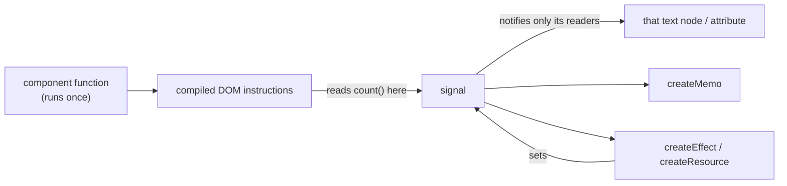

# Solid

Written against Solid 1.9. JSX-shaped like React, but the component function
runs once: signals update the DOM directly, so there is no virtual DOM and no
dependency arrays.

## What it is

Solid takes React's authoring model — components, JSX, props — and replaces its
execution model. A React component function is re-run on every state change;
a Solid component function runs exactly once, and what it returns is a graph of
DOM nodes with signal subscriptions attached to the individual expressions
inside them. Changing a signal updates the text node or attribute that read it,
and nothing else runs.

The consequence is that reads matter, not renders. `count()` inside JSX is a
subscription; `count()` assigned to a variable in the component body is a value
read once and frozen. Most Solid bugs written by React developers are that
distinction.

Against the neighbours: `svelte` gets similar fine-grained updates by compiling
components, where Solid does it with a small runtime plus a JSX transform;
`vue` tracks dependencies the same way but keeps a virtual DOM; React trades
both for a simpler mental model at the cost of re-render management.

## Characteristics

- **What it is good at.** Update cost that does not grow with the size of the
  component tree. Nothing above or below the changed value is touched, so a
  frequently changing value in a large screen stays cheap without memoisation.
- **What it is not good at.** Rewarding React habits. Destructuring props
  breaks reactivity, conditionals must go through `<Show>` rather than `&&` if
  the branch should be re-evaluated, and lists want `<For>` rather than
  `.map()`.
- **Runtime behaviour.** The reactive core is signals, memos, and effects with
  automatic dependency tracking; the JSX compiles to direct DOM instructions.
  Runtime size is small and updates are among the fastest of the entries here.
- **Development experience.** Familiar if JSX is familiar, with fewer rules to
  remember at runtime — no dependency arrays, no `useCallback`, no
  `React.memo`. The rules that remain are about where a signal is read.
- **Ecosystem.** Small. There is a first-party router and a meta-framework
  (SolidStart), but the third-party component market is thin compared with
  React's, and most React libraries do not work unmodified.
- **Learning cost.** Medium. The API is small; unlearning React's re-render
  intuition is the actual work.
- **Operations.** Static output from Vite. Server rendering means SolidStart,
  which is not covered in this repository.

## Files

- `counter.jsx` — `createSignal`, `createMemo`, `createEffect`. Note the
  signals are called as functions (`count()`), not read as values.
- `todo.jsx` — `createStore` for nested state, `<For>` and `<Show>` instead of
  `.map()` and `&&`.
- `resource.jsx` — `createResource` with `<Suspense>` and `<ErrorBoundary>`
  for async data.

## Running

Solid's JSX compiles to DOM instructions, so a build step is required:

    npm create vite@latest solid-demo -- --template solid
    cd solid-demo && npm install
    cp ../counter.jsx src/
    npm run dev

`npm run build` emits static assets; there is no server unless SolidStart is
added.

## What the samples demonstrate

The three files walk the reactive primitives from the simplest state to async
data.

- `counter.jsx` demonstrates the "runs once" rule and what follows from it. The
  comment at the top says where the subscription is created — inside the JSX,
  at the point `count()` is called — and `createEffect` shows tracking without
  a dependency array. `Ticker` in the same file shows `onCleanup`, which is
  where the interval is released when the owning component is disposed.
- `todo.jsx` demonstrates `createStore`, which is what signals become when the
  state is a nested object. The two update forms are both shown on purpose: the
  path syntax `setTodos(predicate, "done", fn)` for a targeted change, and
  `produce()` for a change awkward to express as a path. `<For>` keys by item
  identity and moves DOM nodes rather than rebuilding them; `<Show>` is the
  conditional that actually re-evaluates.
- `resource.jsx` demonstrates async as first-class reactive state.
  `createResource(userId, fetchUser)` ties a request to a signal: change the
  signal and the fetcher re-runs. The in-flight state is surfaced to
  `<Suspense>` and thrown errors to `<ErrorBoundary>`, so the loading and error
  branches are structural rather than a pair of booleans in every component.

Deliberately absent: routing (`@solidjs/router`), a server, and any global
store beyond module scope. A real application adds the router, SolidStart if
SSR is needed, and a data layer if resources need caching across screens.

## How the pieces connect

Compare this with the React diagram in [`react`](../react/): there the arrow
from state goes back into the component function, here it goes straight to the
DOM node.

## Use cases

- **Dashboards and data views.** Many values changing at high frequency in one
  large tree is the case Solid's update model is built for.
- **Embedded or performance-constrained UIs.** Small runtime, no reconciler.
- **Teams already fluent in JSX.** The syntax transfers even though the
  semantics do not.
- **Projects that need a deep third-party component market.** Poor fit; React's
  ecosystem is an order of magnitude larger.
- **Content sites.** Possible with SolidStart, but [`astro`](../astro/) is the
  better tool for HTML-first output.

## Strengths and weaknesses

| | |
| --- | --- |
| Strengths | Fine-grained updates with no virtual DOM and no memoisation work; familiar JSX; small runtime; async modelled as reactive state through `createResource` |
| Weaknesses | Small ecosystem and hiring pool; React knowledge actively misleads (props destructuring, `.map()`, `&&`); server-side story depends on SolidStart, which is younger than the alternatives |
| Suits | Performance-sensitive interactive UIs, small to medium applications, teams willing to learn a second JSX dialect |
| Does not suit | Projects that need many off-the-shelf components, large teams that must hire quickly, content-first sites |

## History and adoption

- Created by Ryan Carniato; the `solid-js` package first appeared on npm in
  April 2018, and 1.0 was released in June 2021.
- The 1.x line has stayed API-stable since; `solid-js@1.9.14` was the `latest`
  tag on npm on 2026-08-13, with a 2.0 release candidate published under the
  `next` tag.
- SolidStart, the meta-framework, is developed alongside it and reached 1.0 in
  2024.
- The project is community-run rather than vendor-owned, and its reactive
  primitives have visibly influenced other frameworks — signals as an idea now
  appear in Angular, Preact, Svelte 5, and Vue's Vapor work. That influence is
  easy to document; deployment numbers are not, and Solid remains a niche
  choice by usage in the [State of JavaScript 2025](https://2025.stateofjs.com/en-US/libraries/front-end-frameworks/)
  survey.

## References

- [solidjs.com](https://www.solidjs.com/) — documentation and tutorial
- [Reactivity guide](https://docs.solidjs.com/concepts/intro-to-reactivity)
- [solidjs/solid](https://github.com/solidjs/solid) — source and changelog
