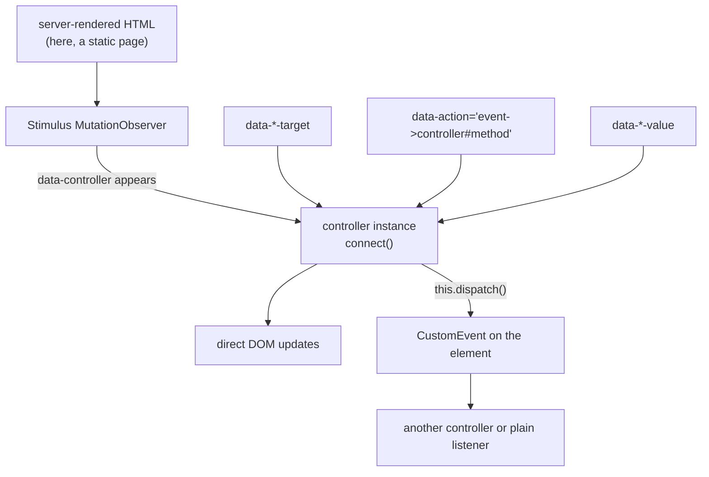

# Stimulus

Written against Stimulus 3, the JavaScript half of Hotwire. It does not render
anything: the HTML (usually server-rendered) says which controller to attach,
and the controller adds behaviour to elements that already exist.

Three concepts, all declared as `data-` attributes:

- targets — named elements a controller wants to reach
- actions — DOM events routed to controller methods
- values — typed state read from attributes, with change callbacks

## What it is

Stimulus starts from the position that the server should render the HTML and
that JavaScript's job is to make the rendered document behave. It calls itself
a modest framework, and the modesty is structural: there is no template
syntax, no virtual DOM, and no way to produce markup from a controller. What it
provides is a disciplined way to find elements, bind events, and read state
that the server put in the document.

The mechanism is a `MutationObserver`. Stimulus watches the document; when an
element carrying `data-controller` appears — on page load, after a Turbo
navigation, or when a fragment is swapped in — the matching controller is
instantiated and its `connect()` runs. When the element goes away,
`disconnect()` runs. This is why Stimulus survives HTML arriving over the wire,
and why a `DOMContentLoaded` handler is the wrong tool in such an application.

Stimulus is one half of Hotwire; the other, Turbo, is what makes navigations
and form submissions swap page fragments instead of reloading. This directory
covers Stimulus alone.

## Characteristics

- **What it is good at.** Keeping browser-side code small and locatable. Every
  behaviour is a class with a name, and the markup says which elements it
  applies to, so a page's JavaScript can be found by reading the HTML.
- **What it is not good at.** Rendering. Anything that needs to build markup
  from data belongs on the server or in a different tool.
- **Runtime behaviour.** No reactivity system: a value changing calls a
  `<name>ValueChanged` method and the controller updates the DOM itself. That
  is more code than a binding would be, and it is explicit.
- **Development experience.** Plain classes, no build required if an import map
  is used, and conventions strict enough that controllers written by different
  people look alike. The `data-*` attributes are verbose — that is the cost of
  the wiring being visible.
- **Ecosystem.** Small and Rails-centred, though nothing about Stimulus is
  Rails-specific: this directory registers its controllers by hand in a plain
  HTML page.
- **Learning cost.** Low: three concepts and a lifecycle. The naming
  conventions (`this.nameTarget`, `this.filterValue`, `filterValueChanged`) are
  the whole API surface to memorise.
- **Operations.** No build with an import map; Rails ships it through
  `importmap-rails` or a bundler. The library is settled enough that upgrades
  are rare events.

## Files

- `index.html` — markup with the `data-controller` wiring, plus the CDN
  bootstrap that registers the controllers.
- `controllers/hello_controller.js` — targets and actions, the smallest case.
- `controllers/clipboard_controller.js` — values, and feature detection in
  `connect()`.
- `controllers/list_controller.js` — a target array, a value change callback,
  and outlet-free communication through a custom event.

## Running

    python3 -m http.server 8000
    # then open http://localhost:8000/index.html

A static server is needed because the page uses an import map and ES modules.
In a Rails application the registration at the bottom of `index.html` is done
for you by `stimulus-loading`, and the controllers live in
`app/javascript/controllers/`.

## What the samples demonstrate

The three controllers are ordered by how much state they need, and `index.html`
shows the markup side of each.

- `hello_controller.js` demonstrates the minimum: two targets and one action.
  `data-action="input->hello#greet"` is the whole event-binding story — event
  name, controller, method. The comment on `connect()` records the reason the
  lifecycle exists: it runs every time the controller attaches, including when
  markup arrives over the wire, which a one-time load handler would miss.
- `clipboard_controller.js` demonstrates values (`static values` with a type
  and a default, read from `data-clipboard-*-value` attributes) and
  progressive enhancement: `connect()` hides the button when
  `navigator.clipboard` is unavailable, leaving the underlying markup usable.
  The empty `disconnect()` is there to mark where teardown belongs.
- `list_controller.js` demonstrates the plural target form (`this.itemTargets`,
  in document order), the `filterValueChanged` callback that re-renders whenever
  the value is assigned — including on connect — and `this.dispatch()`, which
  emits a namespaced `CustomEvent`. The comment states the principle: controllers
  stay independent and communicate through DOM events rather than by reaching
  into each other.

Deliberately absent: Turbo, a server, and any rendering. In a real Hotwire
application Turbo Drive handles navigation, Turbo Frames scope updates to a
region, and Turbo Streams push fragments over WebSockets; Stimulus stays what it
is here. Stimulus 3.2 also added outlets, a typed way for one controller to
reference another — this directory deliberately uses a custom event instead, to
show the loosely coupled option first.

## How the pieces connect

Nothing in this diagram produces markup. Everything the user sees was in the
document already, or was put there by the server.

## Use cases

- **Rails and other server-rendered applications.** The primary case, and the
  one the conventions are shaped for.
- **Pages where HTML arrives over the wire.** Turbo Frames and Streams swap
  markup in, and controllers attach to it automatically.
- **Long-lived internal applications.** A settled API and no build pipeline
  means little maintenance drift.
- **Rich client-side applications.** Poor fit; there is no rendering model.
- **Static sites needing a couple of interactions.** Works, but
  [`alpinejs`](../alpinejs/) is less ceremony for that scale.

## Strengths and weaknesses

| | |
| --- | --- |
| Strengths | Behaviour attaches to markup regardless of where the markup came from; plain classes with a small API; conventions make controllers uniform; no build step required |
| Weaknesses | Renders nothing, so it needs a server that emits HTML; `data-*` wiring is verbose; no reactive bindings, so DOM updates are hand-written; ecosystem is small and Rails-shaped |
| Suits | Server-rendered applications, Hotwire stacks, teams that want their JavaScript to stay small |
| Does not suit | Single-page applications, data-driven UIs that must render lists from JSON, teams without a server rendering HTML |

## History and adoption

- Built at Basecamp and released in 2018, extracted from their own
  applications. In 2020 it was folded into Hotwire alongside Turbo, and the
  package moved to the `@hotwired` scope; 3.0 followed in September 2021.
- `@hotwired/stimulus@3.2.2` was the `latest` tag on npm on 2026-08-13, and
  that release dates from August 2023 — the API is settled rather than
  inactive, which is unusual enough in this directory to be worth noting.
- Stimulus is a default part of new Rails applications, which is its clearest
  documented adoption: it ships in the framework's own generators rather than
  being chosen per project.

## References

- [stimulus.hotwired.dev](https://stimulus.hotwired.dev/) — handbook and reference
- [hotwired.dev](https://hotwired.dev/) — Stimulus in the context of Turbo
- [hotwired/stimulus](https://github.com/hotwired/stimulus) — source and changelog
