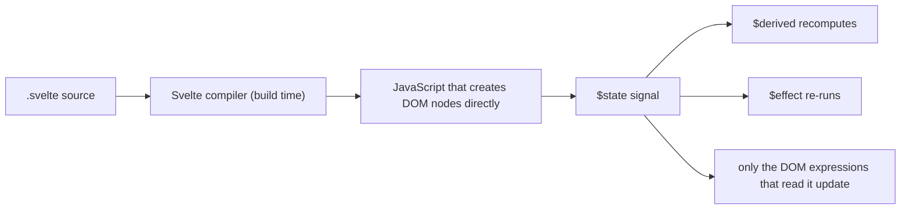

# Svelte

Written against Svelte 5, which replaced the `let x = 0` / `$:` reactivity of
Svelte 4 with runes: `$state`, `$derived`, `$effect`, `$props`.

## What it is

Svelte is a compiler. A `.svelte` file is not shipped to the browser and
interpreted by a framework; it is compiled into JavaScript that creates and
updates DOM nodes directly. There is no virtual DOM to diff, and most of what
other frameworks do at runtime — working out what changed — Svelte works out at
build time.

Svelte 5 kept that compilation model but rebuilt reactivity on signals, exposed
through runes. A rune is a compiler directive that looks like a function call:
`$state(0)` marks a variable the compiler should track, `$derived(...)` marks a
value recomputed from it, `$effect(...)` marks code to re-run when what it read
changes. The result is that reactivity now works in ordinary `.js` modules too,
not only inside components — which is what `counter.svelte.js` in this
directory exists to show.

Against the neighbours: `solidjs` reaches almost the same runtime behaviour
without a compiler for reactivity, `vue` keeps the virtual DOM, and React makes
the re-render explicit. Svelte's distinguishing claim is the amount of code you
do not write.

## Characteristics

- **What it is good at.** Density. A component's markup, logic, and scoped
  styles sit in one file with no imports for reactivity, no `useState`, and no
  dependency arrays. Comparing `TodoList.svelte` here against `todo-app.jsx` in
  [`react`](../react/) is the quickest way to see the difference.
- **What it is not good at.** Being read without knowing the compiler. `$state`
  and `$derived` are not functions you can look up at runtime, `$effect` only
  works where the compiler set up an owner, and runes are allowed in a plain
  module only when the file is named `*.svelte.js`. These are rules of the
  build, not of JavaScript.
- **Runtime behaviour.** Updates are fine-grained: assigning to a tracked value
  runs exactly the DOM updates that read it. The runtime shipped to the browser
  is small — there is no reconciler — and bundles are correspondingly small.
- **Development experience.** Very little boilerplate, first-class scoped CSS,
  and clear compiler errors. The cost is that Svelte 4 material found in search
  results teaches a reactivity model that no longer applies.
- **Ecosystem.** The smallest of the three mainstream front-end options here.
  Component kits and integrations exist but the pool is shallower than Vue's,
  and much of the ecosystem assumes [`sveltekit`](../sveltekit/).
- **Learning cost.** Low for the basics. The runes model adds a second layer:
  deep versus shallow reactivity, where effects may run, and why an exported
  `let` cannot stay reactive across a module boundary.
- **Operations.** Compiled output is static files. Server rendering, routing,
  and endpoints come from SvelteKit.

## Files

- `Counter.svelte` — `$state` and `$derived`, props via `$props()`.
- `TodoList.svelte` — `$state` on an array (deeply reactive: mutating it is
  enough), `{#each}` with a keyed block.
- `counter.svelte.js` — shared state outside a component. Runes are allowed in
  a module only when its name ends in `.svelte.js`.

## Running

Svelte compiles ahead of time, so these need a build step:

    npm create vite@latest svelte-demo -- --template svelte
    cd svelte-demo && npm install
    cp ../Counter.svelte ../TodoList.svelte ../counter.svelte.js src/lib/
    npm run dev

`npm run build` produces static assets in `dist/`, served by anything. For
server rendering and routing, scaffold SvelteKit instead — see the
[`sveltekit`](../sveltekit/) directory.

## What the samples demonstrate

- `Counter.svelte` shows the four runes in one screen: `$props()` with defaults
  destructured from what the parent passed, `$state` for the tracked variable,
  `$derived` for a value computed from it, and `$effect` for the side effect.
  The effect takes no dependency list — it re-runs because it *read* `count`,
  the same tracking rule Solid and Vue use.
- `TodoList.svelte` shows that `$state` on an array is deep: `todos.push(...)`
  updates the view with no reassignment, which is the behaviour that most
  distinguishes runes from React's immutable-update convention. The `{#each}`
  block is keyed on `todo.id` for the same reason React's `key` is, and the
  `{:else}` branch shows the empty-list case that a `.map()` in JSX has to
  express separately.
- `counter.svelte.js` is the interesting file: state shared between components.
  It shows the constraint behind the pattern — an exported `let` cannot stay
  reactive across the import boundary, so the state hangs off a class instance
  and the module exports one of those. `createTimer` in the same file shows the
  other half: an `$effect` with a cleanup return, which is why the function has
  to be called from inside a component that owns it.

Deliberately absent: routing, data loading, and any server. A real application
adds SvelteKit for those, plus form handling and a testing setup. Nothing here
depends on SvelteKit, which is the point — these are plain components.

## How the pieces connect

The compiler boundary is the thing to notice: by the time the browser is
involved there is no template and no diffing, only the update functions the
compiler generated.

## Use cases

- **Interactive UIs with a bundle budget.** Widgets, embedded panels, and
  data-heavy screens where shipping a framework runtime is unwelcome.
- **Applications where the whole team reads the whole codebase.** Less
  ceremony per feature means less to review.
- **Full-stack applications.** Through SvelteKit; Svelte alone has no routing
  or server story.
- **Framework-neutral components.** Svelte can compile to custom elements, but
  [`lit`](../lit/) is the more direct route.
- **Large organisations standardising on one stack.** Possible, but the
  ecosystem and hiring pool are smaller than React's or Angular's, and that is a
  staffing decision more than a technical one.

## Strengths and weaknesses

| | |
| --- | --- |
| Strengths | Least code per feature; no virtual DOM and small runtime; scoped CSS built in; reactivity that also works outside components |
| Weaknesses | Compiler-only semantics that plain JavaScript tooling cannot see; the Svelte 4 to 5 shift dated most existing material; smaller ecosystem and hiring pool; most integrations assume SvelteKit |
| Suits | Small to medium-large applications, teams that value readability, performance-sensitive interfaces |
| Does not suit | Codebases that must share components with React, teams needing a deep third-party component market, projects that cannot adopt a build step |

## History and adoption

- Created by Rich Harris and first released in November 2016. Svelte 3
  (2019-04) introduced the assignment-based reactivity that made the project
  widely known; Svelte 4 (2023-06) was mostly consolidation.
- Svelte 5 (2024-10-19) rebuilt reactivity on signals and introduced runes.
  Both models still appear in tutorials; everything in this directory is the
  new one. `svelte@5.56.9` was the `latest` tag on npm on 2026-08-13.
- Harris has worked on Svelte at Vercel since 2021; the project is developed in
  the open by a core team, with SvelteKit maintained alongside it.
- On adoption: [State of JavaScript 2025](https://2025.stateofjs.com/en-US/libraries/front-end-frameworks/)
  reports Svelte at the top for retention among front-end frameworks — a
  satisfaction measure from a self-selected survey, not a count of deployments,
  and it sits well below React on usage in the same survey.

## References

- [svelte.dev](https://svelte.dev/) — documentation and interactive tutorial
- [Runes](https://svelte.dev/docs/svelte/what-are-runes)
- [sveltejs/svelte](https://github.com/sveltejs/svelte) — source and changelog
