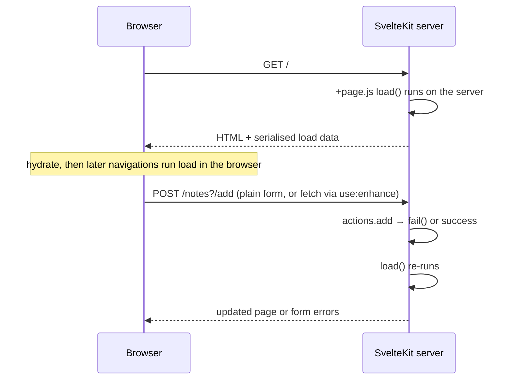

# SvelteKit

Written against SvelteKit 2 with Svelte 5. Routing is filesystem-based and the
`+` prefix names the role of each file:

- `+page.svelte` — the page component
- `+page.server.js` — its server-only `load` and form `actions`
- `+layout.svelte` — shell wrapping the pages beneath it
- `+server.js` — an endpoint (GET/POST handlers, not a page)

## What it is

SvelteKit is the application framework around Svelte: routing, server
rendering, data loading, form handling, and a build that targets whatever host
you point it at. Where Next.js expresses the client/server split through
directives inside files (`"use client"`, `"use server"`), SvelteKit expresses
it in file names. `+page.js` runs in both places; `+page.server.js` never
reaches the browser. That is the whole rule, and it is checkable by looking at
a directory listing.

The second idea it commits to more than its neighbours is progressive
enhancement. A form in a SvelteKit application is a real `<form method="POST">`
that works with JavaScript disabled; `use:enhance` upgrades it to a fetch and
re-runs `load` in place, without a separate code path. Links are plain anchors
that the router intercepts. The sample in `src/routes/notes/` is built that way
deliberately.

Deployment is handled by adapters — Node, static, Cloudflare, Vercel, Netlify —
chosen in configuration rather than by rewriting the application.

## Characteristics

- **What it is good at.** Small surface for the amount of ground covered. The
  conventions are few enough to hold in your head, and the data flow — `load`
  returns, the page receives `data` — is one direction with no cache to reason
  about.
- **What it is not good at.** Ecosystem depth. Fewer component libraries,
  fewer integrations, and fewer people who have solved your problem before than
  the React frameworks have.
- **Runtime behaviour.** Server-rendered by default; the universal `load` runs
  on the server for the first request and in the browser for subsequent
  navigations. Per-route options (`prerender`, `ssr`, `csr`) let a project mix
  static, server-rendered, and client-only routes.
- **Development experience.** Vite, fast HMR, and per-route generated types
  (`./$types`) that make the loader-to-page contract typed even in JavaScript
  files through JSDoc, as this directory does.
- **Ecosystem.** Modest but coherent, with first-party adapters and a small set
  of conventions that most Svelte libraries follow.
- **Learning cost.** Medium and front-loaded: the `+` file conventions, the
  universal-versus-server `load` distinction, and form actions. After that
  there is little framework left to learn.
- **Operations.** `vite build` plus an adapter produces either static files or
  a server bundle. The Node adapter output runs anywhere Node does.

## Files

- `src/routes/+layout.svelte` — nav plus `{@render children()}`.
- `src/routes/+page.svelte` — reads `data` from the parent load.
- `src/routes/+page.js` — a universal `load`, run on the server for the first
  render and in the browser on later navigations.
- `src/routes/notes/+page.server.js` — server-only `load` and two form actions.
- `src/routes/notes/+page.svelte` — `use:enhance` upgrades the plain form post
  into a fetch, without losing the no-JavaScript path.
- `src/routes/api/time/+server.js` — a JSON endpoint.

## Running

    npx sv create sveltekit-demo
    cd sveltekit-demo
    cp -r ../src/routes/* src/routes/
    npm run dev

`npm run build` runs the configured adapter: `adapter-auto` detects common
hosts, `adapter-node` produces a server started with `node build`, and
`adapter-static` prerenders the routes that allow it. `npm run preview` serves
the build locally.

## What the samples demonstrate

Six files, one per role in the routing convention, so the directory doubles as
a map of what each `+` file is for.

- `+layout.svelte` shows the shell and the Svelte 5 change worth knowing: page
  content arrives as a snippet prop rendered with `{@render children()}`, not
  through a `<slot>`. The navigation uses plain anchors, which SvelteKit
  intercepts for client-side navigation and which still work when it cannot.
- `+page.js` shows the universal `load`. It runs on the server for the first
  render and in the browser afterwards, and it uses SvelteKit's own `fetch`,
  which inherits cookies during SSR and has its result serialised into the page
  so the browser does not repeat the request. The comment states the rule that
  keeps secrets safe: this file ships to the client, so credentials belong in
  `+page.server.js`.
- `+page.svelte` shows the receiving end — `let { data } = $props()` — and that
  ordinary component state (`count`) coexists with loaded data.
- `notes/+page.server.js` shows the write path. `load` provides the list, and
  `actions` are named handlers posted to `?/add` and `?/delete`. `fail(400, ...)`
  re-renders the page with a 4xx status and the submitted values intact, which
  is the framework's answer to "the form was invalid" without throwing away
  what the user typed.
- `notes/+page.svelte` shows progressive enhancement in one attribute: the
  forms post normally without JavaScript, and `use:enhance` turns them into
  fetches that re-run `load` in place once it is available.
- `api/time/+server.js` shows the endpoint role: one export per HTTP method,
  standard `Request`/`Response`, `json()` as the response helper, `error()` for
  a typed failure, and `setHeaders` for cache control.

Deliberately absent: a database (an array stands in), authentication, hooks
(`hooks.server.js` for middleware-style concerns), and streaming promises from
`load`. A real application adds those, plus an adapter chosen for the host.

## How the pieces connect

The dividing line is the file name: everything in `.server.` files stays on the
server, everything else may run in both places.

## Use cases

- **Svelte applications that need server rendering.** The default and obvious
  choice; there is no serious alternative in the Svelte ecosystem.
- **Form-heavy applications.** Actions plus `use:enhance` cover the whole
  submit-validate-redisplay cycle with one implementation.
- **Sites that must work without JavaScript.** Progressive enhancement is the
  default here rather than an extra effort.
- **Static sites.** `adapter-static` handles it, though
  [`astro`](../astro/) is stronger for content-first projects.
- **Large applications with many third-party UI dependencies.** The component
  market is thinner than React's; that is a staffing and procurement question
  more than a technical one.

## Strengths and weaknesses

| | |
| --- | --- |
| Strengths | Small, legible conventions; the client/server boundary is visible in file names; genuine progressive enhancement; per-route rendering options; adapters make the host a configuration choice |
| Weaknesses | Smaller ecosystem and hiring pool; two migrations in recent memory (Kit 1→2, Svelte 4→5) dated much published material; fewer hosted-platform integrations than Next.js |
| Suits | Small to medium-large applications, form-driven tools, teams that value a framework they can read in an afternoon |
| Does not suit | React-standardised organisations, projects depending on a deep component market, API-only services |

## History and adoption

- SvelteKit succeeded Sapper; the first public preview was in 2020 and 1.0
  arrived on 2022-12-14. SvelteKit 2 followed on 2023-12-14 and is the current
  line — `@sveltejs/kit@2.70.2` was the `latest` tag on npm on 2026-08-13.
- It is maintained by the Svelte core team, so framework and application layer
  move together; Svelte 5 support landed in the 2.x line rather than requiring
  a new major.
- Adoption follows Svelte's: strong satisfaction scores in the
  [State of JavaScript 2025](https://2025.stateofjs.com/en-US/libraries/front-end-frameworks/)
  survey, with usage well below the React frameworks. Treat both as survey
  signals rather than deployment counts.

## References

- [svelte.dev/docs/kit](https://svelte.dev/docs/kit/introduction) — documentation
- [Routing conventions](https://svelte.dev/docs/kit/routing)
- [Form actions](https://svelte.dev/docs/kit/form-actions)
- [sveltejs/kit](https://github.com/sveltejs/kit) — source and changelog
