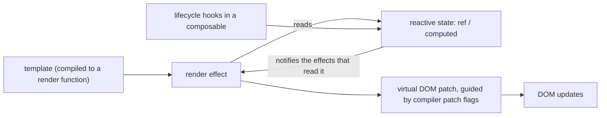

# Vue

Written against Vue 3.5, Composition API only.

## What it is

Vue is a view library built on two ideas: templates that look like HTML, and
reactivity that tracks itself. A `ref` records which render functions read it,
so when its value changes only those re-run. Components do not need to be told
what their dependencies are, and there is no dependency array to keep correct.

Its stated goal is to be adoptable in layers: a single `<script>` tag on an
existing page at one end, a full single-page application with a router and a
build pipeline at the other. Both are supported by design rather than by
accident, and this directory shows both ends — `counter.html` is the script tag,
`TodoList.vue` is the compiled component.

Against the alternatives here: React reaches the same place through functions
and explicit dependencies, `svelte` compiles the reactivity away entirely, and
`angular` covers far more ground than the view. Vue sits between React's "assemble
it yourself" and Angular's "it is all provided", with first-party router, state
store, and build tooling that are optional but conventional.

## Characteristics

- **What it is good at.** Getting a readable screen written quickly. The
  template is HTML with directives, the logic sits above it in `<script setup>`,
  and the styles sit below it scoped to the component — one feature, one file.
- **What it is not good at.** Type checking inside templates is a build-time
  concern handled by `vue-tsc`, not something the editor gets for free from the
  language; expressions in templates are strings until compiled.
- **Runtime behaviour.** Reactivity is proxy-based and fine-grained at the
  dependency level, while rendering still goes through a virtual DOM. The
  compiler marks which parts of a template can change ("patch flags"), so the
  diff skips static subtrees — a middle point between React's full-subtree
  re-render and Solid's no-diff model.
- **Development experience.** Two builds matter and the sample shows both: the
  `esm-browser` build ships the template compiler so markup can live in the
  page, while a bundler pulls the runtime-only build and compiles templates
  ahead of time. Mixing them up is the classic "failed to resolve component"
  confusion.
- **Ecosystem.** Smaller than React's, but more of it is first-party: Vue
  Router, Pinia, Vue DevTools, and Vite all come from the same orbit, so the
  default assembly of a Vue project is far more predictable.
- **Learning cost.** The lowest of the component frameworks in this directory
  for a developer who knows HTML. The one real tax is that two APIs are in
  circulation — the Options API of Vue 2 and the Composition API used here —
  so search results and answers are split between them.
- **Operations.** Plain static files unless SSR is wanted, in which case the
  answer is [`nuxt`](../nuxt/).

## Files

- `counter.html` — runs as is: the full browser build from a CDN, so the
  template can live in the page and be compiled at runtime.
- `TodoList.vue` — single file component with `<script setup>`, `computed`,
  and `<style scoped>`.
- `useMouse.js` — a composable: reactive state plus lifecycle hooks packaged
  as a plain function.

## Running

`counter.html` only needs a browser. The `.vue` file needs a build step:

    npm create vite@latest vue-demo -- --template vue
    cd vue-demo && npm install
    cp ../TodoList.vue ../useMouse.js src/
    npm run dev

Note the two builds: `vue.esm-browser.js` includes the template compiler (what
`counter.html` uses), while a bundler pulls in the runtime-only build and
compiles SFC templates ahead of time.

`npm run build` writes static assets to `dist/`; `npm run preview` serves them.
There is no server component to deploy.

## What the samples demonstrate

- `counter.html` demonstrates the no-build path and the ref-unwrapping rule
  that surprises everyone once: inside `setup()` a ref is `count.value`, but
  the template unwraps it to `count`. It also shows `computed` for derived
  state and `v-if` for conditional rendering, which is what the counter's "over
  ten" line is for.
- `TodoList.vue` is the single file component in full: `defineProps` as a
  compiler macro (no import), `computed` for the remaining count, `v-model` for
  two-way binding on both the draft input and each item's checkbox, `v-for`
  with `:key`, and `<style scoped>`. The scoping comment matters — the compiler
  adds a data attribute to the elements and to the selector, which is why the
  rule cannot leak out of the component.
- `useMouse.js` demonstrates the composable pattern, Vue's answer to what React
  does with custom hooks: state plus the lifecycle that keeps it fresh, in a
  plain function. Each caller gets its own refs, and the teardown travels with
  the state, which is why `onUnmounted` is inside the function rather than in
  the component. `useLocalStorage` in the same file shows the shape reused for
  a different concern.

Deliberately absent: a router, a store, and a server. `useLocalStorage` also
reads `localStorage` at call time, which is browser-only — under Nuxt's server
rendering that line would need a guard, and that difference is the subject of
the [`nuxt`](../nuxt/) directory rather than this one.

## How the pieces connect

The compiler is the part that distinguishes Vue: it knows at build time which
bindings in a template can change, so the runtime patches those and leaves the
rest alone. In `counter.html` that compilation happens in the browser; in
`TodoList.vue` it happens in the build.

## Use cases

- **Product UIs and admin screens.** The sweet spot: forms, tables, and
  dialogs are quick to express, and `v-model` removes most controlled-input
  boilerplate.
- **Progressive enhancement of an existing page.** The CDN build mounts on one
  element and leaves the rest of the document alone — closer to `alpinejs` than
  to a full SPA, without giving up components.
- **SSR, SSG, and file-based routing.** Through Nuxt, not through Vue itself.
- **Component libraries consumed by other frameworks.** Poor fit; Vue
  components are Vue-only. Use [`lit`](../lit/) for that.
- **Very large applications.** Workable, and the first-party router and store
  help, but Angular and Nest-style enforced module boundaries are stricter.

## Strengths and weaknesses

| | |
| --- | --- |
| Strengths | Readable single file components; reactivity without dependency arrays; a coherent first-party ecosystem; genuinely usable without a build step |
| Weaknesses | Two API styles split the documentation and answers; template type safety needs `vue-tsc`; smaller third-party library set than React; the runtime-only versus browser build distinction trips up newcomers |
| Suits | Teams that want conventions without ceremony, applications with many forms and screens, incremental adoption inside an existing server-rendered app |
| Does not suit | Projects needing framework-neutral components, teams already standardised on React tooling, code that must be shared with a React design system |

## History and adoption

- Created by Evan You and first released publicly in early 2014; the `vue`
  package first appeared on npm in December 2013.
- Vue 2 (2016-09) is the version most legacy Vue code targets. Vue 3
  (2020-09-18) was a TypeScript rewrite that introduced the Composition API and
  proxy-based reactivity; Vue 2 reached end of life at the end of 2023.
- Vue 3.5 (2024) refactored the reactivity system internals; it is the line
  this directory targets, and `vue@3.5.41` was the `latest` tag on npm on
  2026-08-13.
- The project is independent — funded by sponsorship rather than owned by a
  platform vendor — and its release notes and RFCs are public on GitHub.
- On adoption: Vue appears in the top five web technologies of the
  [2025 Stack Overflow Developer Survey](https://survey.stackoverflow.co/2025/technology).
  Vite, now the default build tool for most of the directories in this
  repository, came out of the same project.

## References

- [vuejs.org](https://vuejs.org/) — guide and API reference
- [Composition API FAQ](https://vuejs.org/guide/extras/composition-api-faq.html)
- [vuejs/core](https://github.com/vuejs/core) — source and changelog
